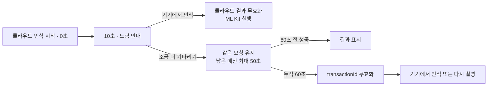

# AI Prompt and Decision Log

Append-only record for transparent AI use. Record user-visible requests and implementation decisions, not hidden reasoning. Never include credentials, private mail bodies, or unrelated personal data.

## Entry template

```text
### YYYY-MM-DD HH:MM KST — actor

- Request/prompt:
- Scope/files:
- Decision/result:
- Disposition: adopted | modified | rejected
- Verification/evidence:
```

---

### 2026-09-23 — user / bootstrap

- Request/prompt: Create and run a bootstrap for the assignment with Conventional Commits containing what/why, a model-and-effort subagent catalog, sub-10KB PRD and AGENTS context files, domain-first CONTEXT, prevention of documentation-only work, E2E guidance for Google ARTEMIS/Chrome DevTools MCP/Python CDP, and a prompt conversation log.
- Scope/files: repository governance, testing guidance, local Git hooks, and prompt logging only; no assignment implementation or external submission.
- Decision/result: Use an isolated local Git repository, require `What:` and `Why:` commit sections, reject docs-only staged changes by default, cap concurrent independent subagents at three, and explicitly separate Android/browser/iOS evidence.
- Disposition: adopted with safety constraints.
- Verification/evidence: bootstrap contract test and generated-repository checks are required before this entry is considered complete.

### 2026-09-23 — user / parallel execution architecture

- Request/prompt: Review whether `flutter_implementer` is too broad and slow; verify with researched evidence whether clearly documented design and planning enables parallel execution; then add a dedicated file-finder agent and apply the validated changes.
- Scope/files: subagent architecture, task ownership contract, planner/executor split, repository-search role, and bootstrap regression checks.
- Decision/result: Replace the broad implementer with `solution_planner` plus reusable bounded executors; add read-only `file_finder`; permit at most three parallel writers only with independent dependencies, non-overlapping paths, isolated worktrees, and main-agent integration.
- Disposition: adopted with parallel-safety gates.
- Verification/evidence: OpenAI multi-agent and GPT-5.6 model guidance, plus red-green bootstrap contract tests and repository hook checks.

### 2026-09-27 — user + AI / 과제 요구사항 해석과 우선순위

- Request/prompt: GitHub 과제 README를 다시 자세히 읽고 기술 스택과 구현 범위를 요구사항에 맞춰 구체화.
- README basis: 필수 흐름은 `카메라 프리뷰 → 정지 이미지 촬영 → OCR → 결과 표시`이며, iOS/Android 패리티·실기기 프리뷰·UI Thread 비차단·나쁜 입력·권한/OCR 오류 처리가 요구된다. UI 디자인과 결과 수정·복사는 평가 대상이 아니다.
- Decision/result: 기능 완성도, 양 플랫폼 동작, 복구 가능한 오류 흐름, 실기기 검증을 시각적 장식이나 부가 기능보다 우선한다. 결과 복사 기능 포함 여부는 아직 미결정이다.
- Disposition: adopted. README의 평가항목인 기능 완성도, 실기기 성능, 예외 처리 및 설계, 테스트 전략에 직접 대응하기 때문이다.
- Rejected/modified: UI 완성도를 핵심 평가항목처럼 취급하는 접근과 문서만 늘리는 작업은 기각했다. README가 UI보다 기능 완성도를 우선한다고 명시하며, 문서는 구현·검증 증거와 연결돼야 하기 때문이다.
- Verification/evidence: 과제 README pinned commit `cb7c0d5323e9c0f347253cf52c09594e18342ced`, lines 187–251.

### 2026-09-27 — user + AI / Flutter와 지원 버전 기준

- Request/prompt: 기술 스택을 정하고 Flutter/Dart는 최신 stable로 올리되 Xcode는 유지한 상태에서 호환 버전을 선택.
- README basis: React Native 또는 Flutter를 자유롭게 선택할 수 있고 선택 이유, 주요 라이브러리, 아키텍처, trade-off와 한계를 README에 설명해야 한다.
- Decision/result: Flutter를 채택하고 로컬 도구를 Flutter `3.47.5` stable, Dart `3.13.4`로 갱신했다. Xcode는 `26.1.1`로 유지한다. 앱의 실질 최소 버전은 카메라와 ML Kit 제약을 합쳐 Android API 24, iOS 15.5로 계획한다.
- Disposition: adopted. 사용자가 Flutter에 숙련돼 있고 양 플랫폼 단일 코드베이스, 공식 카메라 패키지, 테스트 가능한 비동기 상태 구성이 과제 범위에 적합하기 때문이다.
- Rejected/modified: React Native는 과제상 허용되지만 추가 생태계 전환 이점이 없어서 기각했다. 무조건 최신 FlutterFire 조합은 Xcode 26.2 요구와 충돌하므로, 현재 Xcode와 호환되는 FlutterFire BoM `4.11.0` 계열(`firebase_ai 3.10.0`, `firebase_core 4.6.0`)로 수정했다.
- Verification/evidence: `flutter --version`, `flutter doctor`; Flutter, FlutterFire, Firebase iOS SDK, camera, Pigeon, ML Kit 공식 호환성 문서.

### 2026-09-27 — user + AI / 하이브리드 OCR 아키텍처

- Request/prompt: 서버 인식의 정확성과 온디바이스 폴백을 모두 확보하고, 커뮤니티 네이티브 브리지 의존 위험을 줄일 방법을 결정.
- README basis: OCR 엔진은 자유롭게 선택할 수 있고 온디바이스 또는 서버/클라우드 방식 모두 허용된다. 기술 선택의 합리성, trade-off, 알려진 한계를 설명해야 하며 OCR 실패를 처리해야 한다.
- Decision/result: Firebase AI Logic을 통한 Gemini Developer API의 `gemini-3.8-flash`를 1차 OCR로 사용하고, 실패 시 공식 Google ML Kit Text Recognition을 온디바이스 폴백으로 사용한다. 클라우드에는 낮은 thinking level과 구조화된 JSON 응답을 요청한다.
- Disposition: adopted. 클라우드의 광범위한 언어·복잡한 장면 대응과 온디바이스의 오프라인성·예측 가능한 복구 경로를 결합해 실제 사용 가능성을 높이기 때문이다.
- Rejected/modified: 클라우드 단독 방식은 네트워크·할당량·지연 실패 시 복구 경로가 없어 기각했다. 온디바이스 단독 방식은 한국어·라틴 문자 이외의 범용성과 복잡한 이미지 대응 폭이 좁아 1차 방식으로 기각했다. 자체 백엔드는 과제 규모 대비 운영 범위가 커서 기각했다.
- Verification/evidence: Firebase AI Logic 모델·시작·구조화 출력·thinking 공식 문서, Google ML Kit Text Recognition v2 공식 문서.

### 2026-09-27 — user + AI / Firebase 연결, 비용, 키 노출

- Request/prompt: 결제 계정 필요 여부를 먼저 확인하고 모바일 친화적인 Firebase AI Logic을 사용하되 앱 번들에 Gemini API 키를 노출하지 않는 구성을 선택.
- README basis: 서버/클라우드 OCR 사용이 허용되며, 제출 저장소는 iOS/Android에서 빌드·실행 가능해야 한다. 선택 방식의 한계도 문서화해야 한다.
- Decision/result: 별도 Gemini API 키를 앱에 넣지 않고 Firebase 프로젝트 구성 파일과 Firebase AI Logic 클라이언트 SDK를 사용한다. 과제 평가 기간에는 결제 연결 없는 Gemini Developer API 무료 사용 경로를 계획하고, 실제 사용 전 무료 할당량과 모델 가용성을 재검증한다.
- Disposition: adopted with constraints. 모바일 SDK가 인증·API 호출 구성을 단순화하고 비밀 API 키의 직접 번들링을 피할 수 있기 때문이다.
- Rejected/modified: Gradle 변수나 난독화로 API 키를 숨기는 방식은 번들 내부 비밀 보호가 되지 않으므로 기각했다. App Check enforcement는 평가 기기 등록 실패 위험 때문에 평가 기간에는 비활성화하되, 공개 배포 전 활성화가 필요하다는 위험을 명시하는 것으로 수정했다.
- Verification/evidence: Firebase AI Logic 제품·시작·App Check 공식 문서. App Check 의무화 예정일은 `2026-11-02`로 과제 마감 후이지만, 일정은 구현 시 재확인한다.

### 2026-09-27 — user + AI / 공식 카메라와 타입 안전 네이티브 OCR 브리지

- Request/prompt: 네이티브 핵심 기능을 직접 MethodChannel로 연결하는 편이 안전한지 검토하고 공식 지원 수단이 있다면 채택.
- README basis: 양 플랫폼 동작, 원활한 실기기 프리뷰, UI Thread 비차단, 외부 라이브러리 선택 판단력을 평가한다.
- Decision/result: 카메라는 Flutter 팀의 공식 `camera` 패키지(Android CameraX, iOS AVFoundation)를 사용한다. 폴백 OCR만 Pigeon이 생성하는 타입 안전 플랫폼 채널을 통해 Android Kotlin/iOS Swift의 공식 ML Kit SDK에 연결한다. Dart→native 전달은 이미지 bytes가 아니라 임시 파일 경로를 사용한다.
- Disposition: adopted. 검증된 공식 카메라 구현을 재작성하지 않으면서, OCR 브리지 계약은 컴파일 가능한 타입으로 통제하고 대용량 채널 복사를 피하기 때문이다.
- Rejected/modified: 카메라까지 직접 네이티브 브리지로 작성하는 방식은 라이프사이클·프리뷰·회전 처리 범위를 불필요하게 키워 기각했다. 커뮤니티 `google_mlkit_text_recognition` Flutter 래퍼는 핵심 폴백의 유지보수 통제권을 줄여 기각했다. 수기 MethodChannel 문자열 계약은 타입·테스트 위험 때문에 Pigeon으로 수정했다.
- Verification/evidence: Flutter `camera`, Flutter platform channels, Pigeon, Android/iOS ML Kit 공식 문서.

### 2026-09-27 — user + AI / 온디바이스 언어 모델 범위

- Request/prompt: 공식 패키지를 사용하고 한국어 인식이 가능한 온디바이스 모델 범위를 결정.
- README basis: 나쁜 입력에 대한 최소한의 처리와 선택한 OCR 방식의 알려진 한계를 설명해야 한다.
- Decision/result: Android와 iOS에 공식 ML Kit Korean Text Recognition 모델을 번들한다. 이 모델은 한국어와 라틴 계열 문자를 폴백 범위로 삼고, 더 넓은 언어 대응은 1차 클라우드 OCR에 맡긴다.
- Disposition: adopted. 평가 환경에서 모델 다운로드를 기다리지 않고 즉시 오프라인 폴백을 실행할 수 있으며 한국어 과제 사용성을 확보하기 때문이다.
- Rejected/modified: 여러 스크립트 모델을 모두 번들하는 방식은 앱 크기·초기화 비용을 늘려 기각했다. 온디바이스 OCR이 모든 언어를 지원한다고 주장하지 않고 README에 한계로 명시하도록 수정했다.
- Verification/evidence: ML Kit 지원 언어, Android Korean package, iOS KoreanTextRecognizerOptions, ML Kit release notes.

### 2026-09-27 — user + AI / OCR 결과 계약과 빈 결과 의미

- Request/prompt: 잘못 찍은 사진에서 빈 결과가 정상일 수 있으므로 엔진 실패와 구분하고, 모델이 내용을 추측하지 않도록 결과 계약을 결정.
- README basis: 나쁜 입력과 OCR 실패를 모두 처리해야 하므로 두 상태를 사용자 흐름에서 구분해야 한다.
- Decision/result: 클라우드 응답을 구조화된 JSON으로 제한하고 `textDetected`와 `noReadableText`를 명시적으로 구분한다. `textDetected`는 비어 있지 않은 원문 텍스트와 줄바꿈을 보존하며, `noReadableText`의 빈 문자열은 정상 결과다. 상태 없이 빈 문자열만 온 경우는 계약 위반/시스템 실패로 처리한다.
- Disposition: adopted. 정상적인 무문자·판독 불가 입력을 장애로 오인하지 않으면서 모델의 요약·번역·교정·추측을 차단하기 때문이다.
- Rejected/modified: 빈 문자열을 모두 OCR 실패로 취급하는 방식과 모델이 보이지 않는 내용을 보완하는 방식은 기각했다. 저조도·블러·기울어짐의 원인을 확정적으로 진단하는 문구도 오진 가능성 때문에 기각했다.
- Verification/evidence: Firebase AI Logic structured output 공식 문서와 과제 README의 bad-input/OCR-failure 요구사항.

### 2026-09-27 — user + AI / 촬영 및 자연스러운 복구 UX

- Request/prompt: 촬영 후 불필요한 확인 단계를 두지 않고, 사용자에게 내부 오류나 에러 코드를 과도하게 노출하지 않는 재시도 경험을 설계.
- README basis: 카메라 촬영부터 결과 확인까지의 핵심 흐름, 나쁜 입력·권한 거부·OCR 실패의 사용자 경험을 평가한다.
- Decision/result: 촬영 버튼을 누르면 정지 이미지를 캡처한 뒤 별도 확인 화면 없이 인식을 시작한다. 사용자 문구에는 HTTP/Firebase/Gemini/에러 코드를 표시하지 않고 `다시 촬영`, `다시 시도`, `기기에서 인식`처럼 다음 행동을 안내한다. 기술 원인은 이미지·응답 본문을 제외한 내부 진단 로그에만 남긴다.
- Disposition: adopted. 과제의 짧은 핵심 흐름을 유지하면서 사용자가 기술 세부사항을 해석하지 않아도 복구할 수 있기 때문이다.
- Rejected/modified: 모든 저수준 오류를 그대로 표시하는 방식은 과도하고 행동 지향적이지 않아 기각했다. 반대로 모든 실패를 동일하게 삼키는 방식은 테스트와 복구 판단을 어렵게 하므로 내부 오류 분류는 유지한다.
- Verification/evidence: 과제 README의 오류 처리·실제 사용 가능성 평가항목 및 합의된 UX 원칙.

### 2026-09-27 — user + AI / 재시도, 지연, 폴백 전환

- Request/prompt: 서버 인식이 반복 실패하거나 오래 걸릴 때 항상 사용할 수 있는 폴백과 기다릴 선택지를 제공.
- README basis: OCR 실패 처리, 실제 사용 가능성, UI Thread 비차단 및 성능을 평가한다.
- Decision/result: 일시적 오류만 지수 백오프와 jitter로 최대 2회까지 클라우드 시도하며 진행 상태를 `1/2`, `2/2`로 표시한다. 재시도 불가능한 오류는 즉시 온디바이스 폴백을 제안한다. 총 10초가 지나도 요청이 살아 있으면 실패로 단정하지 않고 `takingLonger` 상태에서 `기기에서 인식`을 기본 버튼, `조금 더 기다리기`를 보조 버튼으로 제공한다.
- Disposition: adopted with modification. 10초는 네트워크 실패 판정값이 아니라 사용자가 지연을 인지하는 UX 전환점으로만 사용하고, 명시적으로 더 기다린 사용자는 기존 요청을 계속 기다릴 수 있게 하기 때문이다.
- Rejected/modified: 근거 없이 회차별 8초/12초 타임아웃을 두는 제안은 기각했다. `조금 더 기다리기`가 새 요청을 보내거나 시도 횟수를 늘리는 방식도 중복 비용·경합 때문에 기각했다. 사용자가 로컬 OCR을 선택하면 늦게 도착한 클라우드 결과는 요청 ID로 무시한다.
- Verification/evidence: Firebase AI Logic 기본 요청 제한 180초 및 Dart timeout 변경 문서, Gemini 오류별 재시도 지침, Nielsen Norman Group 응답시간 기준. 구현 전 SDK 버전의 실제 timeout 동작을 다시 검증한다.

### 2026-09-27 — user + AI / 결과가 틀리거나 읽을 수 없을 때의 폴백

- Request/prompt: 서버가 실패한 경우뿐 아니라 결과가 부정확해 보일 때도 항상 다른 인식 방법을 사용할 수 있게 구성.
- README basis: 나쁜 입력과 OCR 실패에 대한 최소 처리 및 실제 사용 가능성을 평가한다.
- Decision/result: 비어 있지 않은 결과 화면에도 사용자가 `다른 방법으로 인식`을 선택할 수 있게 하며, `noReadableText`에서는 `다시 촬영`을 기본 동작, 온디바이스 인식을 보조 동작으로 제공한다. 품질 안내는 `글자가 선명하고 화면 안에 들어오도록 다시 찍어주세요`처럼 통합된 자연스러운 문구를 사용한다.
- Disposition: adopted. 앱이 의미적으로 틀린 OCR 결과를 신뢰성 있게 자동 판정할 수 없으므로 사용자가 판단하고 전환할 수 있는 탈출구가 필요하기 때문이다.
- Rejected/modified: 결과가 비어 있지 않으면 무조건 성공으로 종료하는 방식과, 추정한 저조도·흔들림·기울어짐 원인을 단정적으로 표시하는 방식은 기각했다.
- Verification/evidence: 과제 README의 bad-input 및 exception/UX 요구사항과 합의된 오류 문구 원칙.

### 2026-09-27 — user + AI / Riverpod 상태 관리

- Request/prompt: Riverpod 코드 생성 없이 공식 권장 방식으로 명시적인 상태 관리를 구성.
- README basis: OCR 비동기 처리, 오류 설계, 아키텍처 선택 이유와 trade-off를 설명해야 한다.
- Decision/result: `flutter_riverpod 3.4.3`의 수동 `NotifierProvider`와 immutable sealed `OcrFlowState`를 사용한다. 카메라, 클라우드 OCR, 로컬 OCR을 인터페이스 뒤에 두고 테스트에서는 `ProviderScope` override로 대체한다. 생명주기 자원은 auto-dispose 경계에서 정리한다.
- Disposition: adopted. 작은 과제에서 생성 도구 복잡도를 늘리지 않으면서 명시적 상태 전이, 의존성 교체, stale-result 방지를 테스트하기 쉽기 때문이다.
- Rejected/modified: Riverpod code generation, `build_runner`, annotation 추가는 기존 생성 파이프라인이 없는 프로젝트에 과도해 기각했다. `ChangeNotifier`, `StateNotifier`, `StateProvider` 중심 설계는 Riverpod 3의 권장 방향과 명시적 상태 머신 요구에 맞지 않아 기각했다.
- Verification/evidence: Riverpod code generation 및 3.0 migration 공식 문서, `flutter_riverpod` 패키지 문서.

### 2026-09-27 — user + AI / 임시 이미지 수명과 개인정보

- Request/prompt: OCR에 저장이 필요할 때만 이미지를 유지하고 불필요한 영구 보관은 피하도록 범위를 결정.
- README basis: 실제 사용 가능성, 메모리·성능, 예외 처리 및 설계가 평가된다.
- Decision/result: `camera`가 생성한 임시 이미지 파일을 현재 캡처·재시도·폴백 흐름에서만 공유한다. 재촬영, 결과 화면 종료, 새 인식 시작 시 삭제하고 앱 시작 시 남은 임시 파일을 정리한다. 갤러리나 영구 저장소에는 저장하지 않는다.
- Disposition: adopted. Pigeon에는 파일 경로가 필요하지만 영구 보관은 요구사항이 아니며 개인정보·저장공간·리소스 누수 위험만 늘리기 때문이다.
- Rejected/modified: 결과 이미지를 자동으로 갤러리에 저장하거나 기록 기능을 추가하는 방식은 과제 범위 밖이어서 기각했다. 인식 중 파일을 즉시 삭제하는 방식은 재시도와 폴백을 깨뜨리므로 흐름 종료 시점까지 유지하도록 수정했다.
- Verification/evidence: 과제 README의 성능·설계 평가항목, Flutter camera 캡처 파일 동작, Pigeon 브리지 계약 결정.

### 2026-09-28 — user / AI 결정 기록 형식

- Request/prompt: 사용자와 AI가 나눈 대화를 원문이 아니라 결정 단위로 요약하고, GitHub README에 요구된 AI 제안의 채택·수정·기각과 그 이유를 빠짐없이 기록.
- README basis: 사용한 AI 도구와 활용 범위, 그대로 사용한 부분, 직접 수정·검증한 부분, 기각하거나 직접 판단한 사례를 제출 README에 작성해야 한다.
- Decision/result: 이 문서를 append-only 근거 원장으로 사용하고, 최종 제출 README에는 구현 결과와 일치하는 핵심 사례만 간략히 옮긴다. 미결정 사항은 채택된 것처럼 기록하지 않으며 구현·실기기 검증 결과는 확인 후 별도 항목으로 추가한다.
- Disposition: adopted. 프롬프트 원문 전체를 싣는 것보다 평가자가 판단·검증·개선 과정을 추적하기 쉽고 민감정보 및 불필요한 분량을 줄일 수 있기 때문이다.
- Rejected/modified: 전체 대화 원문 보존은 개인정보와 잡음이 크고 README의 요구가 대화 전문이 아니라 활용·검증·수정·기각 사례 설명이므로 기각했다.
- Verification/evidence: 과제 README pinned commit `cb7c0d5323e9c0f347253cf52c09594e18342ced`, AI 관련 제출 요구 lines 230–236 및 평가항목 lines 239–247.

### 2026-09-28 — user / 결과 화면 범위

- Request/prompt: 인식 결과 화면은 `인식 결과 표시만 제공`하는 안으로 확정.
- README basis: 인식된 텍스트를 사용자가 확인할 수 있어야 하지만 수정·복사 기능은 불필요하며, UI 디자인보다 기능 완성도를 우선한다.
- Decision/result: 결과 화면은 인식 텍스트 표시, 재촬영, 필요 시 다른 OCR 방식으로 다시 인식하는 복구 동작만 제공한다. 텍스트 편집과 전용 전체 복사 기능은 구현하지 않는다.
- Disposition: adopted. 필수 사용자 흐름과 실패 복구에 구현·테스트 시간을 집중하고 제출 직전 부가 기능으로 인한 회귀 위험을 줄이기 때문이다.
- Rejected/modified: 전용 `전체 복사` 버튼과 텍스트 편집 기능은 README에서 요구하지 않고 OCR 정확성·패리티·성능 검증에 기여하지 않으므로 기각했다.
- Verification/evidence: 과제 README pinned commit `cb7c0d5323e9c0f347253cf52c09594e18342ced`, requirements lines 214–221 and constraints lines 224–236.

### 2026-09-28 — user + AI / 최초 권한 요청과 클라우드 전송 안내

- Request/prompt: 별도 안내 없이 곧바로 권한을 요청하기보다 최초 실행 안내가 있는 흐름을 채택.
- README basis: 카메라 권한 거부를 처리해야 하고, 실제 사용 가능한 UX와 예외 설계를 평가한다. 클라우드 OCR 선택의 trade-off와 한계도 설명해야 한다.
- Decision/result: 최초 실행에서 카메라 사용 목적과 촬영 이미지가 인식을 위해 클라우드로 전송된다는 사실을 짧게 안내한다. 사용자가 `카메라 시작`을 누를 때 시스템 권한을 요청하고, 이후 권한이 유지되면 바로 카메라로 진입한다. 로컬 임시 이미지는 앱에 영구 보관하지 않는다고 안내한다.
- Disposition: adopted. 권한 요청과 데이터 전송이 사용자의 명시적 행동 및 현재 맥락에 연결되고, 서버 기반 AI 사용 사실을 촬영 전에 투명하게 알릴 수 있기 때문이다.
- Rejected/modified: 앱 시작과 동시에 설명 없이 시스템 권한 창을 표시하는 방식은 사용 목적과 클라우드 전송을 충분히 전달하지 못해 기각했다. 클라우드 사업자가 이미지를 전혀 저장하지 않는다고 보장하는 문구는 검증 범위를 벗어나므로, 앱의 로컬 영구 보관 여부만 정확히 설명하도록 수정했다.
- Verification/evidence: Apple Human Interface Guidelines `Privacy` 및 `Generative AI`, Android Developers `Request runtime permissions`, 과제 README permission/error-handling requirements.

### 2026-09-28 — user + AI / 나쁜 입력의 최소 처리 범위

- Request/prompt: 이미지 처리는 Firebase·ML Kit 공식 입력 지침과 과제의 저조도·블러·기울어진 텍스트 처리 요구에 맞춰 결정.
- README basis: 저조도, 블러, 기울어진 텍스트 등 나쁜 입력을 최소한 처리하고, OCR이 UI Thread를 blocking하지 않아야 하며 실기기 메모리·발열도 평가한다.
- Decision/result: EXIF/플랫폼 방향 정보를 이용해 올바른 방향으로 입력하고, Firebase의 요청 크기 제한을 초과할 위험이 있을 때만 UI 스레드 밖에서 비율을 유지해 축소한다. 촬영 가이드에는 글자가 화면을 충분히 차지하도록 가까이 촬영하고 밝기와 초점을 확보하도록 안내한다. 판독 불가 시 원인을 단정하지 않고 재촬영과 온디바이스 폴백을 제공한다.
- Disposition: adopted with bounded preprocessing. 공식 지침이 충분한 글자 픽셀, 초점, 올바른 회전을 정확도 핵심으로 제시하며, 이 범위는 양 플랫폼에서 객관적으로 검증할 수 있기 때문이다.
- Rejected/modified: 검증되지 않은 자동 대비·샤픈·노이즈 제거·기하학적 deskew는 글자 획 훼손, CPU·메모리 비용, 플랫폼별 결과 차이 위험 때문에 초기 구현에서 기각했다. 보정이 실제 고정 테스트 세트에서 개선됨을 입증할 때만 별도 변경으로 재검토한다.
- Verification/evidence: Firebase AI Logic `Supported input files and requirements`—단일 이미지, 올바른 방향, 높은 해상도, 20MB inline request limit; ML Kit Text Recognition v2 Android/iOS input guidelines—문자당 권장 픽셀, 초점, 해상도·지연 trade-off; 과제 README bad-input 및 non-blocking requirements.

### 2026-09-28 — user + AI / 카메라 조작 범위와 플래시 검증 게이트

- Request/prompt: 후면 카메라와 최소 플래시 제어를 우선 채택하되 플래시를 테스트 중점사항으로 명시.
- README basis: 실기기에서 원활한 카메라 프리뷰, 저조도 입력의 최소 처리, iOS/Android 기능 패리티, 메모리·발열과 실제 사용 가능성을 평가한다.
- Decision/result: 후면 카메라만 사용하고 지원 기기에서 `자동 플래시/끔` 전환을 제공한다. 전면 카메라 전환, 수동 줌, 탭 초점, 상시 토치는 초기 범위에서 제외한다. 플래시 지원 여부 조회, 버튼 노출, 실제 촬영 시 발광, 앱 background/foreground 후 상태, 예외 복구를 Android/iOS 실기기 중점 검증 항목으로 남긴다.
- Disposition: provisionally adopted, verification required. 저조도 촬영에 직접 도움이 되는 최소 제어이지만 카메라별 지원과 플랫폼 동작 차이가 있어 실기기 증거 없이는 완료로 볼 수 없기 때문이다.
- Rejected/modified: 다양한 카메라 전환과 수동 촬영 제어는 OCR 필수 흐름과 무관하게 상태·테스트 범위를 늘려 기각했다. 플래시 기능이 한 플랫폼에서 불안정하거나 패리티를 깨면 숨김 또는 제거하는 것으로 범위를 축소한다.
- Verification/evidence: Flutter `camera` 공식 패키지의 flash mode API 및 lifecycle 책임; 과제 README real-device preview, bad-input, parity, performance requirements. 현재 실기기 검증 결과는 없음.

### 2026-09-28 — user + AI / 양 플랫폼 평가 범위와 보유 실기기

- Request/prompt: Android 실기기는 확보 가능하며, 과제가 실제로 iOS와 Android 모두를 평가하는지 원문에서 재확인.
- README basis: 요구사항은 `iOS / Android 양쪽 동작 및 기능 패리티`와 `실기기에서 원활한 카메라 프리뷰`를 각각 명시한다. 평가항목의 실기기 성능은 `iOS / Android 프리뷰 성능, UI Thread blocking, 메모리·발열 등`을 확인하며, 제출 저장소는 iOS/Android에서 빌드·실행 가능해야 한다.
- Decision/result: 양 플랫폼 구현·빌드·기능 패리티를 필수로 취급한다. Android는 확보 가능한 실기기에서 카메라·OCR·성능·발열을 검증한다. 현재 iOS 실기기는 확보되지 않았으므로 시뮬레이터 빌드와 자동화 테스트만으로 실기기 프리뷰 성능을 검증했다고 주장하지 않는다.
- Disposition: requirement confirmed; iOS real-device evidence remains an open risk. 원문이 양 플랫폼을 명시적으로 평가하지만 `양 플랫폼 각각의 실기기 테스트 증거 제출`이라는 단일 문장으로 적지는 않았으므로, 양쪽 실기기 검증이 강하게 기대된다는 해석과 문언상 한계를 함께 유지한다.
- Rejected/modified: Android 실기기 검증만으로 iOS 실기기 성능과 패리티까지 충족했다고 간주하는 접근은 기각했다. iOS 기기를 끝내 확보하지 못하면 최종 README에 검증 범위와 한계를 정확히 공개한다.
- Verification/evidence: 과제 README pinned commit `cb7c0d5323e9c0f347253cf52c09594e18342ced`, requirements lines 214–221, evaluation lines 239–247, deliverable lines 249–251; current `flutter devices` lists no Android/iOS device connected.

### 2026-09-28 — user / iOS 실기기 확보 계획

- Request/prompt: 제출 전 iPhone을 임시로 빌려 실기기 검증하는 방향이 현실적으로 가능할 것으로 판단.
- README basis: iOS/Android 패리티, 실기기 프리뷰 성능, 검증 기기와 테스트 한계를 README에 작성해야 한다.
- Decision/result: Android 보유 기기에서 반복 개발 검증을 수행하고, iPhone은 최종 iOS 실기기 smoke/performance pass 전에 임시 확보한다. 실제 기기 모델·OS·검증 결과는 실행 시점에 기록하며 지금은 추정하지 않는다.
- Disposition: adopted as a verification dependency. iOS 시뮬레이터가 실제 카메라 프리뷰·권한·발열·메모리·플래시 동작을 대체할 수 없기 때문이다.
- Rejected/modified: 빌릴 예정이라는 계획만으로 iOS 실기기 검증 완료를 표시하지 않는다. 기기 확보에 실패하면 Android 실기기와 iOS 빌드/시뮬레이터 결과를 구분하고 한계를 공개한다.
- Verification/evidence: user-confirmed expected access; device identity and run evidence pending.

### 2026-09-28 — user + AI / 계층형 아키텍처 승인

- Request/prompt: 클라우드 우선·온디바이스 폴백 A안을 선택하고 상세 계획을 시작하며, 레이어 분리를 핵심 설계 원칙으로 승인.
- README basis: 주요 라이브러리와 아키텍처 선택 이유, trade-off와 한계를 설명해야 하며 비동기 처리·예외 설계·테스트 전략을 평가한다.
- Decision/result: UI, Riverpod `OcrFlowController`, camera/OCR repositories, Firebase AI/ML Kit services, Pigeon native adapters를 분리한다. UI는 immutable 상태만 렌더링하고, controller가 흐름을 조정하며, repository/service가 SDK 오류와 원시 응답을 도메인 결과로 변환한다.
- Disposition: adopted. 외부 SDK·플랫폼 코드를 화면 상태와 분리하면 fake 기반 상태 테스트, iOS/Android 구현 교체, stale-result 차단, 병렬 작업의 파일 소유권을 명확히 할 수 있기 때문이다.
- Rejected/modified: 화면 위젯이 camera/Firebase/Pigeon을 직접 호출하는 구조와 모든 책임을 하나의 controller에 넣는 구조는 테스트 격리와 변경 안정성을 해치므로 기각했다. 작은 과제인 만큼 별도 use-case 계층은 중복 위임만 만들 수 있어 두지 않는다.
- Verification/evidence: user approval; Flutter app architecture official guidance; Riverpod provider guidance; Pigeon package contract.

### 2026-09-28 — user + AI / OCR 상태·데이터 흐름 승인

- Request/prompt: 클라우드 우선·온디바이스 폴백 상태 흐름을 그림으로 검토하고, 해당 플로우 차트를 기록으로 보존.
- Decision/result: 아래 Mermaid 차트를 승인된 데이터 흐름의 시각적 원본으로 사용한다. 최종 설계 spec에는 구현과 일치하도록 이 차트를 옮기며, 이후 상태 이름이나 분기가 바뀌면 새 결정 항목으로 차이를 기록한다.
- Disposition: adopted. 재시도·10초 지연·사용자 전환·stale result·파일 정리가 여러 비동기 분기로 연결되므로 문장보다 상태 전이 그림이 모순을 찾기 쉽기 때문이다.
- Verification/evidence: user-approved design section 2/4; implementation and automated transition tests pending.


### 2026-09-28 — user + AI / 클라우드 watchdog을 60초로 제한

- Request/prompt: Firebase 기본 제한인 180초까지 사용자를 기다리게 하는 것은 과도하므로 앱의 최대 클라우드 대기 시간을 1분으로 제한.
- Decision/result: 앱의 transaction-level cloud watchdog은 첫 `recognizingCloud` 진입부터 총 60초로 설정한다. 이미지 준비, 첫 요청, 백오프, 두 번째 요청이 같은 60초 예산을 공유하며 재시도나 `조금 더 기다리기`가 시간을 초기화하지 않는다. 10초에는 기존 요청을 유지한 채 로컬 전환 또는 계속 기다리기를 제공하고, 60초에는 transaction을 무효화해 로컬 인식 또는 재촬영만 제안한다.
- Disposition: modified. Firebase의 문서상 180초는 SDK 기본 제한이지 이 OCR 앱이 사용자에게 보장해야 할 UX 시간이 아니다. 사용자가 명시적으로 더 기다리더라도 모바일 단일 이미지 OCR에 3분은 과도하므로 사용자가 정한 60초 상한을 우선한다.
- Rejected/modified: 180초 앱 watchdog과 요청별 60초 초기화는 기각했다. 60초 이후 원본 네트워크 Future가 계속 실행될 수는 있지만 `transactionId`를 무효화해 늦은 성공·실패가 UI를 변경하지 못하게 한다.
- Verification/evidence: user-approved product constraint; Firebase AI Logic documents a 180-second default request timeout, while Dart `Future.timeout` documents that the source future can still complete after the timeout. Boundary behavior requires fake-clock tests at 10 and 60 seconds.



### 2026-09-28 — user + AI / 설계 명세 우선과 문서 정합성 게이트

- Request/prompt: README 전체를 검증할 수 있는지 확인한 뒤, 문서와 테스트 중 무엇을 먼저 진행할지 근거를 비교하고 뒤처진 문서 정리를 반드시 할 일로 남김.
- README basis: 기능·성능·예외·테스트뿐 아니라 아키텍처와 라이브러리 선택 이유, trade-off, 검증 기기, AI 채택·수정·기각 과정을 최종 README에 설명해야 한다.
- Decision/result: 합의된 아키텍처·상태·오류·테스트를 단일 설계 명세로 먼저 고정하고, 사용자 검토 후 테스트 중심 구현 계획을 작성한다. `PRD.md`, `CONTEXT.md`, `E2E_TESTING.md`, `AGENTS.md`, 에이전트 카탈로그의 확인된 drift는 구현 실행 전 `D0` 게이트에서 교정한다.
- Disposition: adopted. 현재 앱과 인터페이스가 없어 테스트부터 쓰면 상태·오류·파일 수명·Pigeon 계약을 테스트 코드가 우연히 결정하고 병렬 작업 간 계약이 달라질 수 있기 때문이다.
- Rejected/modified: 기능 코드부터 작성하는 방식과 모든 문서를 먼저 전면 개편하는 방식은 기각했다. 문서 작업 자체가 목적이 되지 않도록 새 문서 부채 목록은 만들지 않고 설계 명세와 이후 구현 계획에 파일별 완료 조건을 둔다.
- Verification/evidence: `docs/superpowers/specs/2026-09-28-altinus-camera-ocr-design.md`; 구현·테스트·실기기 증거는 아직 생성되지 않았으며 확인 후에만 추가한다.

### 2026-09-28 — user + AI / HTTP 클라이언트 경계와 Dio 사용 조건

- Request/prompt: raw HTTP client를 직접 모두 구현·검증하지 말고 Dio를 사용하도록 결정.
- Decision/result: 현재 클라우드 OCR은 공식 `firebase_ai` SDK가 전송을 소유하므로 별도 HTTP 계층이나 Dio 의존성을 추가하지 않는다. 이후 승인된 직접 HTTP endpoint가 생길 때는 raw `dart:io HttpClient` 대신 버전을 고정한 Dio adapter를 사용한다.
- Disposition: adopted with scope clarification. Dio는 interceptor, timeout, cancellation, adapter를 제공해 직접 HTTP 경계에는 적합하지만, 공식 SDK 위에 사용하지 않는 wrapper를 추가하면 의존성과 테스트만 중복되기 때문이다.
- Rejected/modified: Firebase AI Logic SDK를 Dio 기반 직접 REST 호출로 교체하는 방식과, 실제 endpoint 없이 미리 Dio를 추가하는 방식은 인증·보안·오류 처리 범위를 다시 만들거나 미사용 의존성을 남기므로 기각했다.
- Verification/evidence: official `firebase_ai` package metadata identifies it as the Firebase AI Logic SDK and lists its own HTTP dependency; Dio package documentation lists cancellation, timeout, interceptor, and adapter support. Implementation dependency changes are not required by this decision.

### 2026-09-28 — user + AI / 설계 명세 최종 승인과 구현 계획 전환

- Request/prompt: Firebase SDK 전송을 유지하고 직접 HTTP가 생길 때만 Dio를 사용하도록 수정한 설계 명세를 최종 승인.
- Decision/result: D0 문서 정합성, Flutter 기반, 도메인/상태 머신, 카메라, Firebase, Pigeon, Android/iOS ML Kit, 통합 테스트, 양 플랫폼 실기기, clean clone 순서의 테스트 중심 구현 계획을 작성한다.
- Disposition: adopted. 공유 계약과 고위험 비동기 상태를 먼저 고정한 뒤 SDK·플랫폼 adapter를 분리하면 재작업과 병렬 충돌을 줄이고 README 평가항목별 증거를 생성할 수 있기 때문이다.
- Rejected/modified: 모든 기능을 한 에이전트가 한 번에 구현하거나 iOS 통합을 마지막까지 미루는 방식은 기각했다. 병렬 작업은 기반 계약 완료 후 서로 겹치지 않는 Android/iOS 또는 adapter 파일에만 허용한다.
- Verification/evidence: `docs/superpowers/plans/2026-09-28-altinus-camera-ocr.md`; 구현과 기기 검증은 아직 시작하지 않았다.

### 2026-09-28 — user + AI / D0 실행 문맥 정합성

- Request/prompt: 구현 전 stale execution context를 승인된 설계 명세와 일치시키고, 기존 AI 결정 기록은 append-only로 보존.
- Scope/files: `docs/PRD.md`, `docs/CONTEXT.md`, `docs/E2E_TESTING.md`, `.agents/catalog.yaml`; `AGENTS.md`는 확인만 수행.
- Decision/result: Flutter 3.47.5 / Dart 3.13.4, 결과 표시 전용, `firebase_ai` cloud-first와 공식 한국어 ML Kit Pigeon fallback, 수동 Riverpod NotifierProvider, 10초 선택·누적 60초 cloud budget·최대 2회 시도, Android 반복 개발·iPhone 최종 증거, clean-clone/fixed-input/cloud-local/Pigeon/frames/memory/heat evidence를 현재 실행 기준으로 반영했다. 카메라 권한 용어는 공식 패키지 상태(`denied`, `restricted`, `permanentlyDenied`)를 유지한다.
- Disposition: adopted.
- Verification/evidence: pre-edit drift search matched superseded stack, selectable/copyable, Flutter/Dart versions, and uncommitted-stack/decision markers; D0 gates run after reconciliation.

### 2026-09-28 — user + AI / SDK 없는 OCR 도메인 계약과 상태 고정

- Request/prompt: SDK 타입이 새지 않는 OCR·카메라·저장소·설정 경계와 immutable OCR 흐름 상태를 TDD로 구현.
- Decision/result: Cloud/local OCR, 이미지 준비·정리, 설정, 공개 동의, 카메라 계약을 순수 Dart 타입으로 분리했다. `OcrResult`는 공백 텍스트를 거부하고, `transportTransient`만 재시도 가능하다. sealed `OcrFlowState`는 모든 화면 상태와 cloud transaction ID·시도 수·지연 표시·시작 시각 및 결과 엔진을 모델링한다.
- Disposition: adopted. 이후 Firebase, camera, Pigeon adapter와 controller가 컴파일 시점의 SDK-독립 경계에 의존하도록 하기 위함이다.
- Verification/evidence: test-first RED에서 누락된 도메인 타입 오류를 확인한 후 focused test 4개를 GREEN으로 통과했다. `dart analyze lib/features test/features`와 ASCII 임시 복제본의 exact `flutter analyze lib/features test/features`가 통과했다. 원본 한글 상위 경로의 Flutter analyze는 분석 서버 LSP 초기화 파싱 오류로 실패하는 기존 환경 제약이다.

### 2026-09-28 — user + AI / OCR 텍스트 생성자 불변식 보강

- Request/prompt: public `TextDetected` 생성자가 공백 텍스트 불변식을 우회할 수 있다는 리뷰 지적을 수정하고, 모든 failure kind의 retryability를 증명.
- Decision/result: `TextDetected`의 unchecked public const 생성자를 제거하고, 검증하는 public factory와 private const 생성자로 제한했다. 재시도 테스트는 `OcrFailureKind.values` 전체를 순회하여 `transportTransient`만 true임을 확인한다.
- Disposition: adopted. 모든 public construction path에서 `OcrResult`의 nonblank 도메인 불변식을 보장하고 향후 enum 추가 시 보수적 재시도 정책의 회귀를 막기 위함이다.
- Verification/evidence: 새 direct-construction regression test는 수정 전 `returned <Instance of 'TextDetected'>`로 RED를 확인했고, 수정 후 focused test 5개와 전체 test 6개가 통과했다. ASCII 임시 복제본에서 exact `flutter analyze lib/features test/features`도 통과했다.

### 2026-09-28 — user + AI / 단일 소유 OCR transaction controller 구현

- Request/prompt: Task 3의 SDK-독립 port/state만 사용해 수동 Riverpod auto-dispose controller를 TDD로 구현하고, 10초 선택·60초 누적 마감·최대 2회 시도·local 전환·stale completion·lifecycle·정리 경계를 fake clock으로 검증.
- Scope/files: `lib/features/ocr/application/ocr_flow_controller.dart`, `lib/features/ocr/application/ocr_providers.dart`, `test/features/ocr/application/ocr_flow_controller_test.dart`, `test/support/ocr_fakes.dart`.
- Decision/result: 카메라 async operation ID와 cloud/local transaction ID를 분리하고 모든 async 상태 쓰기를 소유권으로 보호했다. 10/60초 timer는 capture 성공 직후와 image preparation 전에 한 번만 시작하고, `keepWaiting`과 retry가 원본 request·attempt·deadline을 바꾸지 않게 했다. 임시 파일은 capture 소유 세대별로 기록해 같은 경로가 재사용되거나 preparation이 늦게 완료되어도 소유 파일만 한 번씩 정리한다.
- Disposition: adopted with deterministic timing injection. 운영 retry는 최대 2초로 제한된 exponential backoff + jitter를 사용하고, 테스트는 500ms 전략으로 override해 경계를 재현 가능하게 고정했다.
- Rejected/modified: request별 60초 timer 재생성, 임의 예외 메시지를 분석한 retry, local 선택 후 cloud 결과 반영, 경로 문자열 전역 dedup은 기각했다. 특히 경로 재사용은 새 파일 소유권이므로 capture 세대별 정리로 수정했다.
- Verification/evidence: 최초 RED는 controller/provider 파일 누락 컴파일 실패였다. lifecycle/recapture 경합은 수정 전 initialize count `expected 1, actual 2`, 경로 재사용은 cleanup count `expected 2, actual 1`로 각각 RED를 확인했다. deadline 후 늦은 cleanup 실패가 `CloudRecovery`를 `RecoverableError`로 덮어쓰는 RED도 추가로 확인했다. 최종 focused 23개, 전체 29개 test가 통과했고, `dart analyze` 및 ASCII 복제본의 exact `flutter analyze lib/features/ocr/application test/features/ocr/application test/support/ocr_fakes.dart`가 문제없이 완료됐다. 원본 한글 상위 경로의 `flutter analyze`는 기록된 analysis-server LSP JSON 파싱 결함으로 코드 진단 전 종료됐다.

### 2026-09-28 — AI review fix / OCR controller 진입·경로 소유·예외 경계 보강

- Review/request: Task 4 리뷰에서 `start`/`acceptDisclosure` 중복·오진입, 오래된 owner와 새 owner가 같은 경로를 겹칠 때의 잘못된 실제 삭제, 그리고 port 예외의 미분류·dispose 후 zone leak를 Important 문제로 보고.
- Decision/result: `start` 진입은 `Booting`, `acceptDisclosure` 진입은 `DisclosureRequired`로 제한하고 각각 pending flag로 첫 await 전부터 debounce했다. 파일 owner ID는 capture 콜백이 아닌 capture 시작 순서로 배정한다. 더 최신 owner의 capture/preparation이 경로를 생산 중이면 오래된 정리를 유예하고, 같은 경로를 이미 최신 owner가 claim했으면 오래된 물리 삭제를 억제한다. 물리 cleanup이 진행 중일 때는 새 capture를 받지 않는다.
- Exception policy: orphan cleanup, disclosure read/write, recapture cleanup, active camera disposal, settings launch 실패를 메시지 파싱 없이 domain `OcrFailure` 회복 상태로 변환했다. operation/state 소유권이 사라진 실패는 현재 상태를 바꾸지 않고, provider dispose 후 camera/file cleanup 실패는 contained future로 종료한다.
- Disposition: adopted. 단순 path-string dedup이나 오래된 cleanup의 즉시 실행은 활성 파일 삭제 가능성 때문에 기각했다. 경로 생산과 물리 cleanup 사이를 owner 세대와 gate로 직렬화했다.
- Verification/evidence: 수정 전 duplicate `start`는 orphan cleanup `expected 1, actual 2`, cloud 중 `start`는 camera initialize `expected 1, actual 2`로 RED였다. 늦은 capture의 정리가 newer active path를 실제 cleanup하고, newer pending claim 전에도 cleanup을 시작하는 RED를 확인했다. orphan cleanup 예외은 수정 전 private message와 stack으로 zone에 누출되고 state가 `Booting`에 머물렀다. 보강 후 focused 42개와 전체 48개 test, in-place `dart analyze`, ASCII 복제본의 exact `flutter analyze lib/features/ocr/application test/features/ocr/application test/support/ocr_fakes.dart`가 통과했다.

### 2026-09-28 — AI re-review fix / live file claims and invalidatable operation tokens

- Review/request: Task 4 second review found that pending path-producer waits could deadlock after invalidation, historical highest-owner state could suppress a necessary later cleanup, failed cleanup discarded retry ownership, entry booleans could be stuck or cleared by an older `finally`, and late preparation could delete the canonical input retained for local OCR.
- Decision/result: startup and disclosure work now use operation-scoped tokens that invalidation abandons independently. Capture assigns an owner and a producer marker before its first await; inactive, deadline, recapture, local selection, and provider disposal settle only the relevant wait marker while the underlying future remains free to finish into stale-owner recording and cleanup. A private ownership helper tracks only live path claims, serializes cleanup per owner, releases ownership only after successful physical cleanup or safe suppression by a newer live claim, and attempts every owner during disposal even after an earlier failure.
- Canonical policy: deadline and local fallback retain the active canonical claim. A late preparation cleans only newly derived stale outputs; recapture or disposal later cleans the retained canonical exactly once. Cleanup failures retain their paths and claims for a later retry.
- Disposition: adopted. Monotonic historical path ownership and shared in-flight booleans were removed because neither represents current ownership. Source futures are not treated as canceled; only controller wait markers and state authority are invalidated.
- Verification/evidence: regression-first failures included pending-start retry `expected 2, actual 1`, never-completing newer producer leaving older cleanup empty, released newer same-path ownership leaving physical cleanup count `expected 2, actual 1`, failed cleanup retry count `expected 2, actual 1`, and deadline-late preparation deleting the canonical path. After the fix, focused 54 tests and full 60 tests passed; in-place `dart analyze` and exact `flutter analyze` in ASCII copy `/tmp/altinus-task4-rereview.rm2kbA` reported no issues.

### 2026-09-28 — user + AI / first-run disclosure and recoverable OCR UI

- Request/prompt: Persist the approved camera/cloud disclosure and render every immutable OCR flow state with only controller actions, concise Korean recovery copy, and mobile-safe layout.
- Scope/files: SharedPreferences disclosure adapter; state-driven OCR presentation; app composition seam; focused persistence and widget tests.
- Decision/result: Acceptance is stored only as `disclosure.camera_cloud.v1`, with a missing value treated as unaccepted. The disclosure states camera purpose, cloud OCR image transfer, and no persistent local image storage. One exhaustive Dart switch maps each approved state to a display-only screen; cloud-only states can transition once to local OCR, whereas local outcomes cannot loop back. No user-facing copy exposes vendor, bridge, transport, exception, or numeric error details.
- Disposition: adopted. A provider-injected app home seam retains smoke bootability until Task 11 wires real adapters instead of adding fake production dependencies.
- Verification/evidence: Missing adapter/screen tests first failed at compilation (RED). Focused persistence/presentation tests then passed (13 tests), including exact `1/2`/`2/2`, 10-second actions, fallback boundaries, unsafe-copy absence, and a small viewport/2x text check. Native-path `flutter analyze` hit the known analysis-server LSP JSON path failure; an ASCII temporary copy completed the same requested analysis with no issues.

### 2026-09-29 — AI review correction / disclosure gate and recoverable progress UI

- Review/request: A recovery from startup failure could enter camera initialization without rechecking the persisted disclosure. The initial UI also lacked recovery actions for camera initialization, capture, and local recognition, and needed stronger copy, reachability, lifecycle, and semantics evidence.
- Decision/result: Every `recapture()` now reads `DisclosureStore.hasAccepted()` after cleanup and before either preview restoration or camera initialization. An unaccepted value returns to `DisclosureRequired`; a read failure returns safe domain recovery; operation ownership guards stale reads. Progress-only states expose the existing recapture action. Dynamic progress, result, empty, and recovery regions are live regions; titles are semantic headings; the viewport minimum height now contains its padding.
- Disposition: adopted. The disclosure gate is a privacy boundary and cannot be bypassed by recovery. Reusing the controller's existing recapture invalidation preserves bounded, user-directed recovery without inventing cancellation or new timeout policy.
- Verification/evidence: Regression-first controller tests failed with `PreviewReady` rather than `DisclosureRequired` and accepted-recapture read count `1` rather than `2`. Widget regressions failed for the missing disclosure screen, missing progress recapture key, and absent heading/live-region semantics. The corrected focused controller suite has 58 passing tests and presentation suite has 19; the final full suite has 85 and ASCII-path analysis has no issues.

### 2026-09-29 — AI re-review correction / serialized camera retry and stable recovery announcement

- Review/request: Retrying while camera initialization was still pending could create a second adapter-owned initialization before the first released its resources. The live-region wrapper was inconsistent across states, generic startup failures implied OCR/capture had already failed, and the lifecycle test did not actually dispose before the callback it intended to test.
- Decision/result: `CameraRepository.dispose()` now documents the adapter contract that it terminates pending initialization/resource ownership. A non-ready recapture invalidates the prior camera operation, awaits that teardown boundary, verifies ownership, then begins exactly one replacement initialization. The controllable camera fake models held initialization cancellation, active/max concurrent initialization, and live sessions. The screen has one stable, top-level live region for every switched state, while titles remain headings. `RecoverableError` presents only the neutral Korean “잠시 문제가 생겼어요. 다시 시도해 주세요.” with “다시 시도”. Startup is deferred to a scheduled second post-frame callback so a real build-phase replacement can dispose the screen before the provider read.
- Disposition: adopted. Starting a replacement before `dispose` completes would violate the camera adapter's exclusive resource ownership. Per-branch live regions were removed because permission and preview transitions otherwise had no consistent announcement container. A neutral recovery avoids making an untrue claim about which operation failed.
- Verification/evidence: New regression tests were RED before the implementation: pending-init recapture observed `disposeCount 0` and stale old initialization remained uncancelled; preview lacked the stable live region; injected raw startup failure lacked the generic copy; and the real build-phase disposal test observed one startup. After the correction, the focused controller/presentation command passed 79 tests, including max concurrent initialization `1`, one live replacement session, stale-completion suppression, preview/denial live semantics, generic unsafe-copy absence, and pre-callback disposal.
- Final verification: full `flutter test` passed 87 tests. The expanded `flutter analyze` scope passed with `No issues found` in a fresh ASCII-path temporary copy after the test fake stopped exposing a private held-initialization type through its public API.

### 2026-09-29 — AI final correction / shared camera teardown ownership

- Review/request: A recovery could read disclosure and exit before disposing a pending invalidated initialization; repeated recovery/lifecycle calls each invoked adapter teardown independently, so a stale teardown could overlap or outlive a replacement session.
- Decision/result: The controller now owns one `_cameraTeardownFuture`. `_ensureCameraDisposed()` starts `CameraRepository.dispose()` once, shares that exact future with every caller, and clears it only when that exact future settles. `recapture()` awaits teardown immediately after invalidation and before file cleanup or disclosure read; after the await, only the current operation can continue. `onInactive`, resume waiting, and terminal provider cleanup use the same boundary. A failed disposal leaves `_cameraNeedsDispose` true for a later user-directed retry, while terminal cleanup remains contained.
- Disposition: adopted. A shared controller boundary is required because repository resource ownership spans controller entry points; independent `dispose()` calls cannot prove ordering or prevent a stale teardown from reaching a newer camera session.
- Verification/evidence: RED controller tests observed `disposeCount 0` when disclosure was false or failed after a pending initialize, two dispose calls for rapid recaptures, and no second teardown after a failed inactive disposal. GREEN passed all four regressions: pending initialization is cancelled before false/error disclosure handling, rapid retries share one held teardown and produce one live replacement session with max concurrent initialization `1`, and teardown failure is retryable without an unhandled future.
- Final verification: focused controller/presentation tests passed 83 tests; full `flutter test` passed 91 tests. The expanded analysis scope reported `No issues found` in a fresh ASCII-path temporary copy; `git diff --check` passed.

### 2026-09-29 — user + AI / official camera adapter and lifecycle-safe preview

- Request/prompt: Integrate only Flutter's pinned `camera 0.12.1` behind an injectable pure facade, preserve SDK-free application/domain contracts, render an isolated preview, and own inactive/resume teardown without stale initialization or capture callbacks.
- Decision/result: Rear-only `ResolutionPreset.high`/audio-off sessions map exact permission codes without message parsing. Adapter initialization, capture, and per-session teardown use generation and single-flight ownership; failed teardown remains retryable, and a stale JPEG is deleted or handed to controller-owned cleanup. `CameraPreviewSurface` alone constructs `CameraPreview`; fake repositories render a neutral placeholder. Auto/off flash appears only after a successful auto probe, hides on failure, and resets through lifecycle reinitialization.
- Disposition: adopted after review corrections. Front-camera fallback, duplicate capture, unsupported flash claims, lost failed-dispose ownership, forgotten stale paths, and concurrent native disposal calls were rejected.
- Verification/evidence: Test-first RED covered missing adapter/lifecycle behavior, rear-only fallback, teardown retry, stale deletion ownership, and single-flight disposal. Final full suite passed 116 tests; exact Flutter analysis passed in ASCII worktree `/tmp/altinus-task6-final.Liu301`; Android debug APK and iOS debug no-codesign app both built. Pinned CameraX uses `.jpg` and pinned AVFoundation defaults to JPEG; physical output/flash parity remains a later real-device gate.

### 2026-09-29 — AI review correction / terminal native teardown and boot lifecycle resume

- Review/request: `CameraController.dispose()` marks the controller disposed before native teardown settles, so a failed native release followed by a successful no-op retry cannot prove exclusive ownership was released. Booting work interrupted by lifecycle also lacked resume intent, and startup could run while the app was initially hidden or paused.
- Decision/result: `CameraPluginRepository` now latches the first teardown failure per concrete session, never invokes that session's dispose again, retains it, and blocks initialize/capture with `interrupted`; only a successful first teardown permits replacement initialization. The controller distinguishes its generic repository-level retry boundary from this terminal official-adapter state. Booting inactive records resume intent, resume creates a new guarded `start()` generation, and stale orphan-cleanup/disclosure completions cannot overwrite the new branch. `OcrScreen` deduplicates all non-resumed lifecycle states and defers initial boot while hidden/paused.
- Disposition: adopted. Process/app restart is the only conservative recovery after an unproven native release; UI remains generic. Controller-level retry remains valid only for repository implementations that can prove later release.
- Verification/evidence: RED observed a second raw dispose being accepted, only one boot attempt after inactive/resume, and hidden/paused mount failing to resume into preview. A production-semantics fake proves a later raw dispose would no-op, while the repository makes only one native call, retains ownership, rejects initialize/capture, and never opens a replacement. Refreshed final verification follows in the Task 6 report.
- Refreshed verification: format checked 26 files with zero changes; focused camera/controller/presentation passed 115 tests and the full suite passed 122. ASCII-path analysis reported no issues; Android debug and iOS debug no-codesign builds both succeeded. The remaining physical-device JPEG/flash/orientation gate is unchanged.

### 2026-09-29 — user + AI / bounded Firebase OCR core; project configuration pending

- Request/prompt: Implement Task 7 Steps 1–3 and a provider-ready Firebase SDK gateway, but stop before choosing or mutating any Firebase project because the user has not authorized which of four existing projects to reuse.
- Scope/files: `lib/features/ocr/data/{firebase_ai_ocr_service,image_preparer,temp_image_store}.dart`, `lib/features/ocr/application/ocr_providers.dart`, and focused data tests. `main.dart`, Firebase generated options/service files, console APIs, billing, and App Check were intentionally not changed.
- Decision/result: Added pinned `firebase_ai` structured OCR with `gemini-3.8-flash`, low thinking, JSON schema, `InlineDataPart`, transcription-only instructions, exact line preservation, strict duplicate/malformed/contradictory response rejection, and public-type-only error mapping. Added async file validation/read/write, 32 MiB source and 8192-dimension/32-Mi-pixel decode guards, isolate-owned decode/EXIF/resize/encode, sub-14-MiB derivatives, canonical preservation, partial-write cleanup, and path/symlink-safe prefixed orphan cleanup.
- Disposition: core adopted; Firebase configuration and live model/quota verification remain `NEEDS_CONTEXT` until the user selects an exact existing Firebase project ID. No `flutterfire configure`, project/app creation, AI Logic enablement, billing/App Check mutation, generated Firebase files, or synthetic `main.dart` initialization was performed.
- Review: independent review initially identified unbounded raster/source inputs, partial derivative retention, and duplicate JSON keys. Regressions were added first and all findings were fixed; final re-review reported no remaining Critical or Important findings.
- Verification/evidence: initial RED was missing production files; later REDs reproduced directory-symlink escape, non-safety block misclassification, duplicate JSON acceptance, excessive source dimensions/bytes, and partial-write retention. Final focused data tests passed 52, full suite passed 174, format/context-budget/diff checks passed, and scoped Flutter analysis reported no issues in ASCII copy `/tmp/altinus-task7-final.8nL1Cy`. Android debug and ASCII-copy iOS debug no-codesign builds succeeded. Original-path iOS build remains affected by the recorded Unicode-path SwiftPM encoding issue, not a Dart compile failure.

### 2026-09-29 — AI review correction / iOS capture cleanup and actual-byte image validation

- Review/request: Follow-up review found that pinned AVFoundation captures live under `Directory.systemTemp/camera`, outside `path_provider`'s iOS cache root; it also identified stat/read races, magic-byte-only upload validation, nonexclusive derivative naming, insufficient deletion identity checks, and incomplete EXIF direction evidence.
- Decision/result: Explicit owner cleanup now accepts only the injected cache root or pinned camera root and fails closed outside them, while startup cleanup remains limited to direct `altinus_ocr_` files in the derivative root. Cleanup rejects links/non-files, walks in-root components, revalidates after resolution, and deletes the resolved candidate. Portable Dart cannot make hostile ancestor replacement and unlink atomic, so the guarantee is intentionally scoped to private mobile sandbox roots. Image preparation and upload recheck actual bytes after stat; upload bytes are dimension/pixel bounded and fully decoded in `Isolate.run`, with MIME derived from the supported decoder. Derivatives use cryptographically random names and OS-exclusive creation with collision retry.
- Disposition: adopted. Silent outside-root cleanup was rejected because the controller would release ownership without deleting the iOS capture; arbitrary `Directory.systemTemp` cleanup and camera-root startup sweeping were also rejected.
- Verification/evidence: regression-first compilation failures proved the new seams were absent. GREEN includes distinct cache/camera-root deletion boundaries, outside/traversal/symlink/root-identity/race rejection, propagated cleanup failures and controller ownership retry, fake/truncated/path-replaced/growing images, bounded decode, exclusive collision retention, clockwise EXIF marker placement, and mirrored EXIF placement. Focused data tests passed 65, full suite passed 187, scoped ASCII-path analysis reported no issues, and Android debug plus ASCII-copy iOS debug no-codesign builds succeeded. Firebase project selection/configuration and live model verification remain explicitly pending user choice.

### 2026-09-29 — user + AI / typed Pigeon boundaries and implicit-engine registration correction

- Request/prompt: Generate reproducible typed Korean OCR/settings Pigeon contracts, keep generated files generator-owned, test app-owned Dart mappings, and correct the later iOS host-registration plan for Flutter 3.47.5's implicit-engine AppDelegate.
- Scope/files: `pigeons/platform_apis.dart`, generated Dart/Kotlin/Swift contracts, Dart OCR/settings adapters, focused adapter tests, and Task 10 registration instructions. No native host implementation or Firebase/external state changed.
- Decision/result: `NativeOcrGateway` and `SettingsGateway` isolate generated clients from app ports. Detected text is preserved, no-readable-text is explicit, null/blank detected text is `invalidResponse`, gateway exceptions are `bridge`, and settings booleans pass through. Task 10 now registers both generated setup classes after plugin registration with `engineBridge.applicationRegistrar.messenger()` and owns Runner Compile Sources membership for generated and handwritten Swift files.
- Disposition: adopted after review correction. `controller.binaryMessenger` was rejected because the committed Flutter template implements `FlutterImplicitEngineDelegate` and has no explicit controller registration boundary.
- Verification/evidence: adapter RED failed on missing types before implementation; GREEN passed the focused mappings. A temporary null-validation regression made the new null contradiction test fail by returning `NoReadableText`, then the restored implementation passed. Pigeon regeneration was stable; scoped analysis passed from an ASCII-path verification copy because the Korean parent path triggers the recorded analysis-server framing defect. Local Pigeon output confirms both `setUp(binaryMessenger:api:)` signatures, and the installed Flutter 3.47.5 template/engine examples confirm `engineBridge.applicationRegistrar.messenger()`.

### 2026-09-29 — user + AI / Android bundled Korean ML Kit hosts

- Request/prompt: Implement Task 9 only: pin bundled Korean ML Kit `16.0.1`, implement the generated asynchronous OCR/settings hosts, register both in `configureFlutterEngine`, preserve recognized text exactly, and close recognizer resources on every terminal path without logging image paths or text.
- Scope/files: Android app Gradle dependency, `MlKitNativeOcrHostApi`, `AndroidAppSettingsHostApi`, `MainActivity`, and focused JVM policy tests. Generated Pigeon files, iOS, Firebase configuration, and external state were not changed.
- Decision/result: Missing, blank, and non-file paths fail before decoding; `InputImage.fromFilePath` and `KoreanTextRecognizerOptions` feed asynchronous ML Kit processing. Blank results map to `NO_READABLE_TEXT`, nonblank results are returned byte-for-byte as Kotlin strings, and all host errors use sanitized Pigeon `FlutterError` callbacks. Recognizers are closed before every success/failure callback after creation. App settings opens the package details intent.
- Disposition: adopted with a narrow pure-policy seam and JUnit dependency; Robolectric and broader native test dependencies were not added. No path or recognized text is logged or included in error details.
- Verification/evidence: RED failed because `NativeOcrPolicy` did not exist; GREEN passed 3 focused policy tests. Pigeon regeneration produced no generated diff, the 7 Dart adapter tests passed, ML Kit resolved exactly to `16.0.1`, app-scoped Gradle unit tests and `lintDebug` passed, and a debug APK built. The aggregate unqualified Gradle test task also ran CameraX plugin-owned Robolectric tests and failed 55 of 180 because the plugin misdecoded the Korean parent path; this is retained as an environment risk rather than masked by app configuration changes.

### 2026-09-29 — AI review correction / background OCR, one-shot completion, and host teardown

- Review/request: Follow-up review found that file validation and `InputImage.fromFilePath` ran on Flutter's platform thread, OCR/settings callbacks and recognizer cleanup lacked adversarial exactly-once evidence, host handlers were not detached, and settings URI construction introduced a `UseKtx` lint warning.
- Decision/result: The generator source now annotates only `NativeOcrHostApi.recognizeKorean` with Pigeon 29.0.4's serial background task queue; regenerated Kotlin and Swift bind that method to a background queue while settings remains on the platform thread. OCR uses injectable image-loader and recognizer-session seams plus an `AtomicBoolean` terminal gate, closes a created session once before replying, sanitizes loader/engine failures, contains callback exceptions, and preserves exact nonblank text. Existing regular files, including symlinks to regular files, pass the host path check; actual image validity remains `InputImage.fromFilePath`'s responsibility and corrupt inputs map to `INPUT_IMAGE_FAILED`. Settings separates launch failure from callback delivery and builds `package:` URIs with `Uri.fromParts`.
- Lifecycle/result: `MainActivity` gives only `applicationContext` to OCR, retains Activity only for settings, pairs generated setup/teardown through a tested registration lifecycle, unregisters both handlers with `setUp(messenger, null)`, clears host references, and calls `super.cleanUpFlutterEngine`.
- Verification/evidence: Regression-first tests initially failed on missing seams, exposed a recursive registration callback as `StackOverflowError`, and rejected a private invalid-path signal; each was corrected before GREEN. The 19 focused JVM tests cover missing/corrupt inputs, sync creation/process failures, async success/blank/failure, task-result and close failures, callback exceptions, duplicate completion, settings intent/failure/callback behavior, and detach/re-register pairing. `:app:testDebugUnitTest :app:lintDebug`, the 7 Dart adapter tests, ML Kit `16.0.1` dependency insight, stable Pigeon regeneration, and `flutter build apk --debug` pass. The exact aggregate `./gradlew testDebugUnitTest lintDebug` also passes in a fresh ASCII-path copy under temporary JDK 21 (504 tasks); JDK 17 cannot run CameraX's SDK 36 Robolectric cases. App lint reports no `UseKtx` issue (only two pre-existing Gradle/resource warnings).

### 2026-09-29 — user + AI / iOS static Korean ML Kit and settings hosts

- Request/prompt: Implement Task 10 only with the exact `GoogleMLKit/TextRecognitionKorean` `8.0.0` pod, generated Pigeon host protocols, orientation-aware offline Korean OCR, sanitized one-shot replies, settings launch mapping, implicit-engine registration, and compile-source membership exactly once.
- Scope/files: iOS Podfile/lock/workspace/project integration, `MlKitNativeOcrHostApi`, `IosAppSettingsHostApi`, `AppDelegate`, and focused RunnerTests. Generated Pigeon files, Android production code, Firebase configuration, and external state were not changed.
- Decision/result: `UIImage(contentsOfFile:)` plus a non-nil `cgImage` validates inputs, `VisionImage.orientation` preserves `UIImage.imageOrientation`, and `KoreanTextRecognizerOptions` selects the Korean recognizer. Whitespace trimming is used only to decide `NO_READABLE_TEXT`; nonblank recognized text is returned exactly. A lock-protected terminal gate admits only the first synchronous, asynchronous, duplicate, or reentrant completion. Failures expose only stable codes and generic messages with nil details and no logging. Settings checks `canOpenURL` before calling `open`, then returns only the resulting boolean. Both generated handlers register immediately after plugins through `engineBridge.applicationRegistrar.messenger()`.
- Static/lifecycle disposition: The exact top-level pod is locked at `8.0.0`, and its installed vendored recognizer binary is a static archive. Changing the entire Podfile to static framework linkage was rejected because the existing Flutter SwiftPM Firebase products then duplicated GoogleUtilities/Promises/GTMSession symbols. The official installed ML Kit headers expose main-queue completion and no recognizer close API; the recognizer is retained through its completion and released by ARC afterward.
- Verification/evidence: RED compiled the test target against missing `NativeOcrRunner`, `NativeOcrReply`, and settings host seams. GREEN runs 9/9 RunnerTests on an iOS 18.5 x86_64 simulator, including exact text/blank mapping, sanitized failures, duplicate completion, synchronous throw-after-callback, and settings outcomes. Pigeon regeneration is byte-stable, all 194 Flutter tests and the 7 focused adapter tests pass, and Flutter analysis reports no issues. A clean ASCII-path copy passes `pod install`, iOS debug no-codesign build, and simulator `xcodebuild`; the original Korean parent path still fails inside Flutter's SwiftPM path encoding, so Xcode was not modified to mask that environment defect. Physical-device Korean accuracy, settings navigation, orientation, latency, and resource behavior remain a device gate.

### 2026-09-29 — user + AI / production composition and guarded full-flow smokes

- Request/prompt: Compose Tasks 4–10 into the production app, prove the disclosure/camera/cloud/local flow with deterministic fakes, generate on-device OCR fixtures, and add native/live smokes without selecting or mutating a Firebase project.
- Scope/files: async SharedPreferences bootstrap, Riverpod production defaults, `AltinusOcrApp`/`OcrScreen` composition, a typed pending-Firebase gateway, deterministic PNG fixture support, fake-flow/native/live integration tests, and focused composition/live-gate tests. No Firebase project/app, credential, billing, App Check, remote, submission, or external state changed.
- Decision/result: `main()` creates `SharedPreferencesDisclosureStore` before `runApp`; providers construct the camera, Firebase service, bounded preparer, temporary-file store, Pigeon local OCR, and Pigeon settings adapters. Until an exact Firebase project is authorized, `FirebaseConfigurationPendingGateway` fails only an attempted cloud request with the typed `configuration` category, so app startup remains safe. A future configured bootstrap must initialize Firebase and override `firebaseModelGatewayProvider` with `FirebaseSdkModelGateway`.
- Test disposition: The fake E2E test first failed because `AltinusOcrApp` still rendered the placeholder shell. GREEN covers disclosure acceptance, preview, pause/resume camera reinitialization, cloud multiline preservation, recapture, a transient cloud failure with a pending second attempt, local selection, and rejection of the late cloud success. Canvas/TextPainter generates Korean/Latin, no-text, dark/low-contrast, 90-degree, and multiline PNGs; repeated generation is byte-deterministic and all variants decode without committed binary fixtures.
- Live safety: Native OCR executes only on Android/iOS. Live cloud skips only when `RUN_LIVE_OCR` is false or the target is non-mobile; when enabled on mobile it explicitly calls `Firebase.initializeApp()` and treats missing/failed authorized configuration as a test failure, not a skip. Its sole success record contains model, platform, device, OS, and commit; it never logs image bytes/path or recognized text.
- Verification/evidence: Full Flutter suite passed 200 tests. The fake E2E passed on `flutter-tester`; native and live smokes compiled and reported their expected guards. ASCII copy `/private/tmp/altinus-task11.5gK6dL` passed `flutter analyze`, the 200-test suite, Android debug build, and iOS debug no-codesign build. Pigeon regeneration is byte-stable, context budgets and handwritten diff checks pass. Physical Android/iPhone native OCR and authorized-project live cloud runs remain explicit device/configuration gates.

### 2026-09-29 — AI review correction / deterministic full-flow clock

- Review/request: The fake full-flow test overrode every external adapter and retry delay but still inherited `DateTime.now` through `ocrNowProvider`.
- Decision/result: The integration test now injects one fixed UTC clock, removing its final wall-clock dependency without adding a test-only production API.
- Verification/evidence: `flutter test -d flutter-tester integration_test/fake_flow_test.dart` passes 1/1 after the fixed-clock override; review found no Critical or Important issues.

### 2026-09-29 — user + AI / evaluator README and release-gate evidence

- Request/prompt: Create a concise evaluator README only from verified evidence; include setup, architecture, pinned dependencies, hybrid cloud-to-local behavior, 10/60-second bounds, privacy lifecycle, tests, AI examples, the Korean-parent-path workaround, and exact pending gates. Do not claim Firebase/live cloud, physical-device results, or flash readiness.
- Decision/result: Added `README.md` with a typed Firebase-pending default disclosure, source-commit-bound release-gate table, and explicit Android/iPhone/Firebase/flash blocks. The handoff uses no credentials, images, recognized-text logs, or raw model output. It records that a configured cloud gateway requires a separately authorized existing Firebase project and that local Pigeon fallback remains the evaluation path after recovery.
- Disposition: adopted as a documentation handoff backed by repository code, task reports, lockfiles, the pinned assignment README, and fresh commands. The final ASCII clean-clone command outputs are appended after the committed-branch proof; they are not inferred from prior debug builds.
- Fresh initial verification/evidence: on source commit `2aff05253de75ffd55b7bf418419527efd176feb`, `flutter pub get`, Pigeon regeneration plus generated-file diff, and the requested Dart format gate passed; `flutter test` passed 200 tests; `flutter build apk --release` passed and reported a universal `84.5MB` APK. The original Korean-parent path reproduced the known analyzer LSP `FormatException: Unterminated string` before source diagnostics and the known SwiftPM percent-encoded Firebase package path failure before iOS compilation. No source/Xcode workaround was applied; an isolated ASCII-path verification follows.
- ASCII clean-clone evidence: committed branch `0bb87c62312c0398753831775e372c1acf171a1a` was cloned to `/private/tmp/altinus-task13-clone.hTu5St/altinus-ocr`. `flutter pub get`, Pigeon regeneration plus `git diff --exit-code`, `flutter analyze` (no issues, 4.3s), and `flutter test` (200 tests) passed. Android debug/release and iOS debug/release no-codesign builds passed. Observed universal APK sizes were 189M debug and 84.5MB release; the observed iOS `Runner.app` directories were 171M debug and 68.8MB release. Xcode created two untracked SwiftPM workspace metadata directories after iOS build; no tracked-file diff was produced. These builds do not replace hardware execution or live Firebase verification.

### 2026-09-29 — review correction / ARTINUS identity and evaluator-mode clarification

- Review/request: Correct the evaluator-visible company name from Altinus to ARTINUS; make the Firebase-unconfigured evaluator flow, actual temporary-file lifecycle, live-run metadata defines, clean-tree evidence, and AI-use categories explicit.
- Decision/result: The visible Flutter title, Android application label, and iOS display name now say `ARTINUS OCR`; internal Dart/package/bundle identifiers remain unchanged to avoid unnecessary integration churn. README now specifies the intentional default evaluator flow `촬영 → configuration recovery UI → 기기에서 인식`, canonical-file retention for local re-recognition, and bounded startup sweep. The prior absolute ASCII clone path is clarified as ephemeral verification evidence only; it is removed from evaluator-facing README instructions.
- Disposition: adopted after a title widget RED/GREEN cycle and code-path review of `TempImageStore`/`OcrFlowController`. No Firebase, device, submission, or credential action is authorized by this correction.
- Verification/evidence: the new title assertion failed while no `ARTINUS OCR` widget existed, then `flutter test test/app_smoke_test.dart` passed 3/3 after the copy update. Full `flutter test` passed 200 tests; Pigeon regeneration stayed stable; Android debug build passed in the original worktree. An isolated ASCII-path copy passed `flutter analyze` (no issues) and iOS debug no-codesign build. The earlier absolute clone path was ephemeral verification context only; evaluator-facing instructions now use `$ARTINUS_CLONE_DIR` and a generic ASCII temp root.

### 2026-09-29 — AI review correction / SwiftPM status wording

- Review correction: `git status --porcelain --untracked-files=all` reports files rather than directory entries. The final evaluator wording now identifies two untracked `Package.resolved` files below Xcode-created SwiftPM workspace metadata directories; the tracked tree remained clean.

### 2026-09-29 — whole-branch pre-release review / evaluator fallback, native taxonomy, and locks

- Review/request: Four Important static findings required a clean-checkout evaluator path, code-only native error mapping, contradictory Pigeon response rejection, reproducible Android/iOS dependency resolution, and evaluator-facing trade-off disclosure.
- TDD decision/result: `CloudOcrService` now exposes an explicit pending-configuration capability. Only that capability combined with typed `OcrFailureKind.configuration` proceeds directly to local OCR; configured gateway configuration/service failures retain recovery. Controller, widget, app-smoke, and fake-flow tests first failed against the old recovery path and then passed without message parsing or concrete-class checks.
- Native decision/result: `PigeonLocalOcrService` catches `PlatformException` explicitly and maps `INVALID_IMAGE_PATH`/`INPUT_IMAGE_FAILED` to `invalidInput`, `OCR_FAILED` to `recognizer`, and channel/null/unknown codes to `bridge`. A `noReadableText` reply accepts only `text == null`; empty and non-empty text are contradictory bridge responses. Focused tests cover each code, generic failures, and both contradictions; raw codes never reach UI copy.
- Locking decision/result: Gradle locks all app configurations. A clean clone exposed `kotlin-stdlib-common:2.4.0` only when Flutter's assemble graph ran; declaring that module as app `runtimeOnly` lets the supported `:app:dependencies --write-locks` command persist debug/profile/release runtime configurations. Manual lock edits and lenient mode were rejected. Xcode-generated Runner project/workspace `Package.resolved` files are identical; CocoaPods `Podfile.lock` remains authoritative for `firebase_ai`, which does not yet support Flutter SwiftPM.
- Verification/evidence: RED reproduced the pending recovery tap, coarse bridge classification, contradictory empty reply acceptance, and default-mode Android dependency lock validation failure. GREEN focused tests passed 155, app smoke passed 3, and fake integration passed 2. Fresh ASCII clone `9101ac1701e36bb3101efb95ffb32a2e99c1ab35` passed Pigeon byte-stability, `flutter analyze`, all 213 Flutter tests, 2 fake integration tests, default-mode locked Android debug build, app JVM tests/lint, and iOS debug no-codesign build. Gradle lock regeneration remained SHA-256 `dc93b92fae0976f297e6978f1c8392a326bd5b21eef205817c6274d37e4115ec`; both SwiftPM locks and post-resolve output remained `300c9e8c5be6d6b31b633179f945c82f9406b1865344c3952fb591b971b52438`; tracked contents stayed clean.
- Evidence hygiene: Pigeon 29.0.4 regeneration is byte-stable and its generated Dart trailing spaces were not hand-edited. Whitespace verification is scoped to handwritten source. Firebase project/app creation, App Check, credentials, device execution, push, submission, and external state remained untouched.

### 2026-09-29 — final review correction / App Check disclosure and pending-service invariant

- Review correction: `firebase_ai` transitively packages App Check artifacts even though the app does not activate App Check, install a token provider, or configure enforcement. README, design, and release-gate wording now distinguishes packaged dependencies from unconfigured runtime/security behavior rather than calling App Check absent from the build.
- Test evidence: A focused controller regression now covers pending capability plus typed `service` failure and proves it retains cloud recovery without invoking local OCR. This complements pending-plus-configuration auto-local coverage and the configured configuration/service matrix; the controller file passed 75 tests and the full suite passed 214.

### 2026-09-29 — independent review follow-up / pre-dispatch local path and default lock mode

- Review/request: A pending evaluator gateway still entered `recognizingCloud`, started 10/60-second timers, invoked `ImagePreparer`, and called Firebase before its typed configuration fallback. The same review found that evidence called Gradle locking “strict” even though the build never sets `LockMode.STRICT`.
- TDD decision/result: Four controller regressions first failed because cloud state/preparation occurred and no local request existed. After canonical ownership is recorded, a stable `configurationPending` capability now starts local OCR immediately. Held/failing preparers, the cloud service, and cloud budget remain untouched; local success/failure, recapture/dispose one-time cleanup, and stale completion are covered. Configured capability `false` remains cloud-first with configuration/service recovery.
- Fallback disposition: The post-dispatch typed configuration fallback was removed. In the committed provider topology the capability is a stable composition fact, so that branch is unreachable; retaining it would create a second, failure-time policy that could reinterpret a real configured-gateway error.
- Locking correction: `lockAllConfigurations()` uses Gradle's default lock mode. Existing lock state constrains and validates resolution; only explicit STRICT adds failure when a locked configuration has no associated state. `:app:resolvableConfigurations` and the generated lockfile each name 57 configurations with empty set differences. No lock mode or lockfile content was manually changed.
- Verification/evidence: Fresh ASCII clone `b3642340b1a154d6ec2840024b51d94f17650219` passed byte-stable Pigeon regeneration, `flutter analyze` with no issues, all 216 Flutter tests, 2 fake integration tests, and the Android debug build. Supported lock regeneration preserved SHA-256 `dc93b92fae0976f297e6978f1c8392a326bd5b21eef205817c6274d37e4115ec`; resolvable/lock-state configuration counts were 57/57 with both differences empty, and tracked contents remained clean.

### 2026-09-29 — user + AI / dedicated Firebase project and durable mobile identity

- Request/prompt: Create the explicitly authorized Firebase project `artinus-ocr-bongjae-202609` with display name `ARTINUS OCR Assignment`, register exactly one Android and one iOS app as `dev.bongjae.artinusocr`, then align both native projects and regenerated Pigeon output in one commit. Do not enable billing or App Check, create alternate identifiers, or generate Firebase SDK configuration yet.
- Remote decision/result: The exact project ID was proved absent before creation. The active project was created without a billing flow, then one active Android app (`1:867285305627:android:b00b0c0a36bcd8780f6bbe`) and one active iOS app (`1:867285305627:ios:f03ea9c48ae6ee7a0f6bbe`) were registered with the approved namespace. Project number `867285305627` and the app IDs are non-secret identifiers; no access token or SDK configuration was recorded.
- Source decision/result: `.firebaserc` binds the repository to the exact project. Android namespace/application ID, Kotlin source/test packages and paths, Pigeon Kotlin package/output path, and all Runner/RunnerTests bundle IDs now share `dev.bongjae.artinusocr`; no flavors, extra application entry point, or extra Runner scheme was added. Pigeon was generated only from `pigeons/platform_apis.dart` twice, with identical SHA-256 hashes on the second run.
- Verification/evidence: Remote JSON assertions confirmed the exact active project and exactly two approved apps. The 15 Dart adapter tests, Android `:app:testDebugUnitTest`, and all 216 Flutter tests passed; direct `dart analyze` reported no issues. `flutter analyze` itself reproducibly exits before source diagnostics because Flutter 3.47.5 truncates its LSP initialization payload at this repository's Korean parent path, and `xcodebuild -list` remains blocked by the separately documented percent-encoded SwiftPM path defect. Static assertions verified one Android app module/entry point, one shared Runner scheme, two expected Xcode targets, three Runner IDs, three RunnerTests IDs, nine Kotlin package declarations, no stale example identifier, formatting, diff hygiene, and context budgets.

### 2026-09-29 — user + AI / generated Firebase mobile configuration

- Request/prompt: Generate FlutterFire configuration only for the approved dedicated Firebase project and its existing Android/iOS apps, pin direct `firebase_app_check 0.4.2`, refresh native lock state with supported generators, verify without exposing client API key values, and do not activate Firebase or App Check at runtime.
- TDD decision/result: `test/firebase_options_test.dart` first failed because `lib/firebase_options.dart` did not exist. FlutterFire CLI 1.3.2 then generated Dart, Android, and iOS client configuration for project `artinus-ocr-bongjae-202609` and namespace `dev.bongjae.artinusocr`; the focused test passed afterward. The CLI's CI validation required the existing `Runner` target to be stated alongside the requested iOS output path, so `--ios-target=Runner` was added without creating a target, scheme, flavor, or alternate entry point.
- Dependency/integration result: `firebase_ai 3.10.0` and `firebase_core 4.6.0` stayed pinned; `firebase_app_check 0.4.2` changed only from transitive to direct. Generated Android Google Services plugin and iOS resource membership changes were retained. The supported Gradle lock generator and two ASCII-path iOS no-codesign builds produced stable tracked lock state with no manual lock edits.
- Verification/evidence: Sanitized assertions matched both generated mobile configs to the approved project/apps and confirmed the remote inventory remained exactly one Android plus one iOS app before and after generation. Independent review strengthened the durable test from a nonempty Android ID check to exact approved Android and iOS app-ID assertions. The focused test passed 1/1, the full Flutter suite passed 217 tests, the Android debug build passed, and ASCII-path `flutter analyze` plus iOS debug no-codesign build passed. The original Korean parent path reproduced the known Flutter analyzer framing failure and SwiftPM percent-encoded path failure; no source workaround was introduced. App Check provider activation/enforcement, billing, signing, runtime Firebase bootstrap, push, and submission remain untouched.

### 2026-09-29 — user + AI / opt-in Firebase and App Check bootstrap

- Request/prompt: Add the sole `ARTINUS_CLOUD_EVIDENCE=true` production composition switch, initialize the committed Firebase options and mobile App Check providers in strict order only when enabled, preserve the default direct-local evaluator path, sanitize bootstrap failures, and avoid all live Firebase or remote configuration actions.
- TDD decision/result: The five bootstrap tests first failed to compile because the bootstrap module, runtime seam, factory, and configured-failure gateway did not exist. The minimal implementation returns the pending gateway before constructing a production runtime when disabled; when enabled it executes `firebase.initialize`, `appCheck.activate`, then `gateway.create`. Initialization, activation, and gateway-construction exceptions are contained as a non-pending typed configuration failure without logging or retaining raw exception text.
- Runtime decision/result: Production initialization uses `DefaultFirebaseOptions.currentPlatform`. The pinned `firebase_app_check 0.4.2` source confirms the requested `AndroidProvider.playIntegrity` and `AppleProvider.appAttestWithDeviceCheckFallback` activation API; activation is guarded to Android/iOS. `main()` resolves the gateway before `runApp` and overrides the Riverpod provider alongside the disclosure store. No flavor, scheme, target, entry point, dependency, remote App Check setting, billing, signing, or external state changed.
- Verification/evidence: Bootstrap tests passed 5/5, smoke tests 3/3, controller tests 77/77, fake integration tests 2/2, and the full Flutter suite 222/222. The default tests record no Firebase runtime call, cloud request, image preparation, or cloud timer path. The original Korean parent path reproduced the known analyzer LSP framing failure before source diagnostics; an ASCII-only clone reported no issues. Context-budget, diff, secret-pattern, and production-log scans passed.

### 2026-09-29 — user + AI / Android evidence signing and App Check registration

- Request/prompt: Create one dedicated Android evidence signing identity for `dev.bongjae.artinusocr`, register its SHA-256 with the existing Firebase Android app, require it for `ARTINUS_CLOUD_EVIDENCE=true`, preserve clean-checkout builds, and register only Play Integrity without billing or unrelated service changes.
- Build/security result: Gradle now decodes Flutter's comma-separated Base64 dart defines during configuration. A cloud-enabled build fails with the stable registered-identity message unless all four ignored signing properties are present; ordinary clean-checkout release/debug behavior retains the debug-signing fallback. The RSA-4096 key and password file live outside the repository under owner-only directory/file modes, and the ignored local `android/key.properties` is not tracked. No password, keystore, debug token, or environment dump was recorded.
- Remote result: Existing Android app `1:867285305627:android:b00b0c0a36bcd8780f6bbe` was resolved before mutation and initially had no certificate hashes. The dedicated public certificate SHA-256 `B9:61:41:1C:0F:D0:2D:24:ED:94:CD:8A:06:A2:D2:C5:5B:19:58:6C:AD:6F:F2:4C:4E:8A:89:8E:4F:6F:E5:26` is now the sole registered SHA-256. Firebase Console registered Play Integrity only for the Android app; the iOS app remains unregistered and the project remains on Spark.
- App Check disposition: The App Check API table reports `Firebase AI Logic 사용을 시작하여 앱 체크를 사용 설정하세요.` and exposes no enforcement control because Firebase AI Logic is not started in this project. That exact state was confirmed without enabling billing or another service; live token/cloud evidence remains Task 7.
- Verification/evidence: Before the change, a cloud-enabled no-key release incorrectly built. Afterward, an ASCII clean clone built debug and rejected the same release at Gradle configuration with the required message. Owner `signingReport`, `apksigner`, the external certificate, and Firebase all matched the public SHA-256; the enabled release APK verified. ASCII-path `:app:testDebugUnitTest`, `:app:lintDebug`, `flutter analyze`, and all 222 Flutter tests passed. Aggregate `./gradlew test` in the Korean-character worktree still runs third-party camera plugin Robolectric tests and fails 55/180 from its known path/Java environment; app-owned tests pass independently.

### 2026-09-29 — AI review follow-up / fail-closed Android signing policy

- Review/request: Prevent partial or invalid `key.properties` from silently falling back to debug signing, require the exact approved alias and a regular keystore file, sanitize malformed Base64 dart defines, and ensure every cloud-enabled Android artifact uses the registered identity.
- TDD result: An isolated ASCII-clone configuration harness first showed all four expected sanitized failures absent on the committed implementation: partial properties, wrong alias, nonexistent store file, and malformed Base64. The enabled signing report also proved debug still used `AndroidDebugKey`. After the minimal Gradle change, the four cases fail with stable sanitized messages, while absent configuration retains ordinary evaluator debug behavior.
- Signing result: When `ARTINUS_CLOUD_EVIDENCE=true`, Gradle `configureEach` assigns `registeredRelease` to debug, release, profile, and debugAndroidTest. Fresh enabled debug and release APKs both pass `apksigner` and match the sole Firebase SHA-256 entry. No remote Firebase or App Check mutation occurred; the SHA list was read only.
- Verification/evidence: The patched ASCII clone built ordinary no-key debug, rejected enabled no-key debug and release before compilation, passed the four invalid-fixture checks, app-owned JVM tests, Android lint, Flutter analysis, the 5 focused bootstrap tests, and all 222 Flutter tests. The owner enabled debug/release builds passed and both certificate digests matched the dedicated keystore and Firebase.

### 2026-09-29 — user decision / evaluator-convenience credential exception (option B)

- Decision: The user selected option B: include the minimum assignment-only, revocable evaluation credentials in the repository so a reviewer can clone and run the cloud-first path without a separately delivered secret bundle. The README must identify this explicitly as a take-home build-convenience trade-off, not a production recommendation.
- Accepted scope: the dedicated Android assignment keystore/signing properties and one registered iOS App Check debug token may be tracked. Android retains the registered Play Integrity identity; iOS uses the debug provider only in debug mode because the available Personal Team cannot use App Attest. Cloud-first recognition, two-attempt recovery, the 10/60-second bounds, and bundled local fallback remain unchanged.
- Rejected scope: no Gemini Developer API key, service-account credential, Firebase CLI token, Apple account/session, `.p12`, provisioning profile, production signing asset, billing attachment, or former-employer asset may enter the repository. iOS release must not contain or activate the debug token.
- Risk acceptance and recovery: Firebase's official guidance says App Check debug tokens should not be committed publicly. This exception knowingly prioritizes evaluator reproducibility for a dedicated Spark/no-billing project. The token and certificate identity are monitored and revoked after evaluation; deleting a later Git commit is not treated as secret removal.
- Evidence state: this entry records the approved design decision only. Credential creation/registration, code guards, clean-clone cloud execution, release-token absence, physical-device behavior, and revocation remain unverified until implemented and tested.

### 2026-09-29 — user + AI / evaluator cloud bundle and monitored live smoke

- Request/prompt: Make the approved option-B checkout cloud-first without a
  separate evaluator secret handoff, keep cloud OCR, use Android Play Integrity
  for outside-Play evaluation, use an iOS debug provider only where the observed
  Personal Team permits it, keep AI monitoring enabled for usage evidence, and
  never expose technical error details to the user.
- Remote result: The dedicated `artinus-ocr-bongjae-202609` project remained on
  Spark. Android Play Integrity was registered with the sole assignment
  certificate and outside-Play-compatible policy. One iOS evaluator debug token
  was registered without printing it. Firebase AI Logic uses Gemini Developer
  API with default App Check enforcement; Agent Platform, template-only, and
  authenticated-user modes stayed disabled. AI monitoring was enabled at 100%
  sampling by the user's explicit choice. No billing, client Gemini key,
  service-account credential, database, Authentication, Storage, Analytics,
  app-store resource, push, or submission action was added.
- Credential disposition: The repository tracks only the approved dedicated
  Android signing identity/properties and iOS debug token. iOS profile/release
  fail closed. Expanded Android and iOS release outputs contained neither the
  token value nor its source identifier. This is documented as a revocable
  take-home convenience exception, not production credential practice.
- Debugging evidence: The first iOS simulator run proved App Check token
  acquisition but every AI request failed. Minimal text/schema/image probes
  showed the failure was common to all request shapes. Inspection of pinned
  `firebase_ai 3.10.0` showed the header is attached only when
  `FirebaseAI.googleAI(appCheck: ...)` receives the active instance. A RED
  regression first required that dependency to cross the gateway boundary; the
  minimal implementation then passed focused and full tests.
- Live result: A fresh ASCII clone at `899bf4c` passed the canonical production
  bootstrap live smoke on an iOS 18.5 simulator with `gemini-3.8-flash` and a
  generated non-sensitive fixture. Firebase console aggregate monitoring then
  displayed request, success/failure, latency, and token metrics. Diagnostic
  failures are included in those aggregates, so they are not presented as a
  product success-rate claim; trace inputs/outputs were not opened or copied.
- Verification/evidence: Pigeon regeneration remained clean; Flutter analysis
  reported 0 issues; 227 Flutter tests and 2 fake full-flow tests passed;
  Android debug/release, app tests/lint, and iOS debug/release no-codesign builds
  passed; the Android release certificate matched the sole Firebase entry; and
  release-token containment passed. A clean iOS clone needed the documented
  debug no-codesign build before integration test to initialize mixed
  SwiftPM/CocoaPods state.
- Limits: No physical Android or iPhone was connected. Camera, local Korean OCR,
  physical attestation, permission/lifecycle/orientation/flash, performance,
  heat, 10-cycle, and platform-parity evidence remain blocked. The simulator
  smoke is supplemental only.

### 2026-09-29 — final code evidence / reproducible containment and remote quota block

- Review correction: The initial App Check regression exercised only an
  injected generation seam, and the release-token claim had no evaluator-run
  command. The gateway now constructs its production `FirebaseAI` client
  through a tested helper that receives the active `FirebaseAppCheck` instance.
  A sanitized executable verifier and leak-fixture test now cover real release
  outputs without printing the token.
- Clean-clone result: Code evidence commit `7152334` passed byte-stable Pigeon
  regeneration, Flutter analysis with 0 issues, 228 Flutter tests, 2 fake
  integration tests, Android debug/release, Android app tests/lint, and iOS
  debug/release no-codesign builds. The Android release certificate matched the
  sole Firebase SHA-256; both release outputs passed token containment.
- Live revalidation: The earlier canonical live success remains tied to
  `899bf4c`. At `7152334`, two canonical requests failed at the sanitized
  service boundary. A temporary disposable-clone diagnostic then reached the
  SDK quota-exceeded branch. Firebase's official quota/error guidance says a
  429 can represent exceeded project quota or exhausted model capacity. No
  billing, quota-increase, or production-source diagnostic change was made.
- Evidence policy: Do not relabel the earlier success as a `7152334` pass. Keep
  remote quota/capacity and both physical-device matrices explicitly blocked;
  the product-level two-attempt path still offers bundled on-device OCR.

### 2026-09-29 — user + AI / simulator-first native evidence

- Request/prompt: Run everything the simulator can credibly prove before
  waiting for physical Android and iPhone hardware.
- Result: An ASCII checkout at `30cb3d0` on iPhone 16 Pro/iOS 18.5 passed the
  real Pigeon → Swift → Korean ML Kit integration for generated Korean/Latin,
  multiline, rotated, and no-text fixtures. Detected fixtures preserved Korean
  and Latin core tokens, and multiline retained its newline/token evidence. A
  missing image mapped to sanitized
  `invalidInput`; ten sequential native OCR calls passed. The deterministic
  fake full-flow passed 2/2 and RunnerTests passed 9/9 on x86_64.
- Debugging evidence: The Korean source path failed before native execution due
  to the existing SwiftPM percent-encoding issue. Direct XCTest after Flutter
  integration then read a deleted temporary test-listener path from generated
  Xcode settings. `flutter build ios --simulator` restored
  `FLUTTER_TARGET=lib/main.dart`, and the already-pinned x86_64 RunnerTests
  command passed. No production workaround was introduced.
- Limits: The simulator does not prove camera hardware, permission/settings
  recovery, flash, physical App Check, device orientation, frame/memory/heat,
  or platform parity. Ten native OCR calls are not ten capture cycles.

### 2026-09-29 — user + AI / 429 diagnosis and bounded model failover

- Request/prompt: Determine why the evaluator could receive 429 instead of
  blindly keeping the same client request, then implement a policy that avoids
  making one exhausted model the single point of failure.
- Console evidence: Firebase AI Logic monitoring showed 11 iOS requests in the
  observed 24-hour window: 4 successful requests plus `RESOURCE_EXHAUSTED` and
  `INTERNAL` failures. The Firebase AI Logic gateway quota was 100 requests per
  minute per project/user/region and showed no current saturation. The Gemini
  API quota page for the same Spark project showed a 20-request free-tier daily
  limit for `gemini-3.8-flash`, a seven-day peak above 90%, and a daily reset
  immediately after the latest 429 interval. This makes daily model quota the
  best-supported explanation for that latest 429; earlier same-minute 429s
  followed by successes remain consistent with transient capacity/rate events.
  The same console showed a 500-request model-specific daily limit for
  `gemini-3.5-flash-lite`. These different model limits do not remove Firebase
  AI Logic's shared gateway limits.
- Decision/result: Attempt 1 remains `gemini-3.8-flash`. Only transport, 408,
  429/quota, and 5xx failures wait 1,000–1,250ms and use
  `gemini-3.5-flash-lite` for attempt 2. Configuration, unsupported location,
  safety/recitation, invalid input, and malformed responses stop after one
  cloud call. A transaction still has a two-call and cumulative 60-second cap;
  two failures produce the existing natural local-OCR/recapture choice with no
  vendor, model, exception, status, or error-code disclosure.
- SDK constraint: `firebase_ai 3.10.0` converts quota-containing messages to
  `QuotaExceeded`, but otherwise exposes some sub-500 server errors only as a
  `ServerException.message` and drops response headers/status. The adapter
  therefore normalizes underscore/space variants and recognizes only a narrow
  prefix allowlist of official retryable tokens/messages, including the
  documented `Resource exhausted` form. Unknown messages remain nonretryable.
  This is a pinned-SDK compatibility exception, not a general string-parsing
  policy; dependency upgrades must re-check and preferably remove it.
- Rejected/modified: Repeating `gemini-3.8-flash` after its daily limit was
  rejected because it cannot recover the evaluator flow. Automatically running
  local OCR without consent was rejected because the approved UX offers a
  choice after cloud exhaustion. Calling both models concurrently, making a
  third cloud call, enabling billing, adding raw HTTP/Dio, and exposing 429 or
  internal errors were also rejected. The initial claim that model quotas were
  fully independent was corrected: only the observed model-specific daily
  limits differ; shared gateway quotas still apply.
- Verification/evidence: TDD first failed on the missing attempt contract and
  on Firebase's official space-separated 429 message. Focused controller,
  adapter, domain, and widget suites then passed; the full Flutter suite passed
  240 tests and fake integration passed 2 tests. Android debug/release, Android
  unit/lint, and ASCII-path iOS debug/release no-codesign builds passed. Release
  token containment passed. On an iPhone 14 Pro Max iOS 18.3 simulator, the
  production Firebase/App Check bootstrap made a live
  `gemini-3.5-flash-lite` request with a generated non-sensitive fixture and
  returned a nonblank result. This proves fallback model/config/schema
  compatibility, not physical-device camera or attestation.
- Sources: Firebase AI Logic
  [error codes](https://firebase.google.com/docs/ai-logic/error-codes),
  [quota model](https://firebase.google.com/docs/ai-logic/quotas), and
  [supported models](https://firebase.google.com/docs/ai-logic/models);
  Gemini API [troubleshooting](https://ai.google.dev/gemini-api/docs/troubleshooting)
  and [Gemini 3.5 Flash-Lite](https://ai.google.dev/gemini-api/docs/models/gemini-3.5-flash-lite).

### 2026-09-29 — cloud failover final review and commit binding

- Review correction: Independent review found that the first allowlist handled
  `RESOURCE_EXHAUSTED` but missed Firebase's documented space-separated
  `Resource exhausted, please try again later.` form. A RED regression using
  the official-shaped message failed as predicted. The classifier now
  normalizes underscore/space forms and requires an anchored retryable prefix
  followed by an exact ending or narrow punctuation boundary. Similar unrelated
  text remains nonretryable.
- Final result: Commit `13fc11b` contains the two-model strategy, official 429
  regression, nonretryable one-call matrix, 1,000–1,250ms bound, live-smoke
  selector, and evaluator documentation. Full Flutter tests passed 244/244;
  fake integration passed 2/2; ASCII-path analysis reported 0 issues; Android
  debug/release and app unit/lint passed; iOS debug/release no-codesign passed;
  release credential containment passed; and the source-equivalent final ASCII
  copy repeated the live `gemini-3.5-flash-lite` smoke successfully.
- Independent re-review: Critical 0, Important 0. HR/recruiter 93/100 and
  hiring manager/development lead 92/100. Physical Android/iPhone camera,
  attestation, flash, performance, and thermal gates remain blocked and are not
  upgraded by simulator evidence.

### 2026-09-30 — user + AI / simulator E2E and Play Store AVD

- Request/prompt: Run every defensible E2E path on simulators/emulators, then
  install an actually bootable Play Store AVD instead of treating simulator
  limitations as app failures. Do not promote simulator results to real-device
  evidence.
- Defects found and corrected: Android's permission sheet temporarily sent the
  app to `inactive`, causing the pending camera initialization to be disposed
  and permission requests to loop. A RED lifecycle test reproduced it; the
  screen now preserves only `CameraInitializing` across that transient state,
  while hidden/paused still dispose. Target-specific Android integration builds
  also exposed that locking every `io.flutter` engine ABI conflicts with
  Flutter's selected target ABI; Gradle now ignores only `io.flutter:*` in the
  lock while third-party versions remain locked. Simulator tests explicitly
  begin resumed, and the cross-platform OCR fixture asserts the stable
  `MULTILINE` token because Android ML Kit reads the leading generated `O` as
  zero.
- Android evidence: API 36 emulator UI exploration passed disclosure, initial
  denial and settings recovery, preview/capture, rapid-tap single flight,
  empty-result recapture, background/resume, and rotation. A newly installed
  `AltinusPlayStore33` (Pixel 7, Android 13/API 33,
  `google_apis_playstore/arm64-v8a`) booted with software rendering; ADB,
  `sys.boot_completed=1`, and `com.android.vending` were verified. Native OCR
  passed 3/3 and fake flow 2/2. Live cloud stopped before model dispatch because
  Play Integrity returned App Check 403 for the sideloaded debug build. An API
  30 Play Store AVD reproduced the more specific outdated-Play-Store `-14`
  condition; API 36.1 remained ADB-offline on this host.
- iOS evidence: iPhone 14 Pro Max iOS 18.3 simulator passed native OCR 3/3,
  fake flow 2/2, RunnerTests 9/9, and both primary/fallback live cloud smokes.
  The current ASCII copy passed device debug and simulator builds after the
  documented one-time native dependency bootstrap.
- Verification: ASCII-path `flutter analyze` reported 0 issues and all 245
  Flutter tests passed. Focused lifecycle tests passed 8/8; framework fake flow
  passed 2/2; Android debug build plus 422-task unit/lint passed. The Korean
  source path still reproduces Flutter 3.47 analyzer LSP framing failure, so it
  is recorded as a tool/path issue rather than a code failure. Physical camera,
  Play Integrity, flash, performance, heat, and cross-device parity remain open.
- Sources: Gradle dependency-locking ignored dependency patterns
  (<https://docs.gradle.org/current/userguide/dependency_locking.html>) and
  Google ARTEMIS (<https://github.com/google/artemis>). ARTEMIS was not needed
  for the deterministic run; ADB/UIAutomator exploration supplied the bounded
  emulator evidence.

### 2026-09-30 — user + AI / initialization-time lifecycle reconciliation

- Request/prompt: Recheck whether the proposed deferred-inactive camera fix is
  actually appropriate before implementation, then proceed with the validated
  option.
- Evidence reviewed: Flutter's official lifecycle definition; the exact locked
  `camera 0.12.1`, Android CameraX `0.7.5`, and iOS AVFoundation `0.10.3+1`
  permission/initialization paths; the repository controller, adapter, and
  lifecycle tests.
- Decision/result: modified. A widget-owned resume-only flag was rejected as
  incomplete because initialization can finish while the app remains inactive
  and an async resume can be superseded. The approved A+ design moves lifecycle
  phase and generation ownership into `OcrFlowController`: transient inactive
  lets a permission result settle, a granted session completed while inactive
  is released, background forces teardown, and resume reopens only while its
  generation remains current. No permission dependency or native bridge is
  added.
- Verification boundary: design only. Existing lifecycle tests passed 8/8 but
  do not cover the newly identified races. Implementation requires the RED
  cases listed in
  `docs/superpowers/specs/2026-09-30-camera-lifecycle-reconciliation-design.md`;
  physical Android/iPhone behavior remains unclaimed.

### 2026-09-30 — user + AI / lifecycle reconciliation implementation

- Request/prompt: Proceed inline with the approved A+ lifecycle design, keep
  planning and execution evidence explicit, and do not claim simulator or
  widget coverage as physical-device proof.
- RED evidence: transient `inactive -> resumed` disposed a pending
  initialization (`expected 0, actual 1`); a grant completed while inactive
  retained the session (`expected dispose 1, actual 0`); the background test
  failed to compile because `onBackgrounded` did not exist; a stale resume
  reopened the camera after a newer inactive transition (`expected initialize
  1, actual 2`); and the widget parking regression observed no teardown
  (`expected 1, actual 0`). Three older controller tests were corrected to
  enter `resumed` before directly invoking foreground-only actions; their
  token/disposal assertions were preserved.
- Decision/result: executable commit `1353fc9` makes `OcrScreen` a lifecycle
  translator and centralizes phase, generation, pending-initialization, and
  teardown ownership in `OcrFlowController`. Transient inactive can reuse the
  same pending permission request; a granted session that completes while
  inactive is parked; hidden/paused/detached force release; and a resume
  continuation cannot initialize after a newer lifecycle generation. Permission
  denial keeps the existing recovery path and never auto-retries.
- Verification/evidence: a source-equivalent ASCII copy at
  `/private/tmp/altinus-lifecycle.yQUEX2` passed `flutter analyze` with 0
  issues, lifecycle widget tests 11/11, controller tests 85/85, all Flutter
  tests 252/252, Android debug build, iOS debug device no-codesign build, iOS
  simulator debug build, and the context-budget check. The first
  empty-directory analysis attempt was detected and excluded before evidence
  was recorded. The clean-copy simulator build initially reproduced the
  documented `Pods_Runner` bootstrap-order failure; the documented device
  no-codesign bootstrap then passed, and the simulator retry passed.
  `git diff --check` passed on the executable range. Physical Android/iPhone camera,
  permission-sheet timing, flash, App Check, performance, heat, and parity
  remain open final gates.

### 2026-09-30 — user + AI / physical Android preview and controls

- Request/prompt: After a real Android permission grant and capture, the user
  observed that the camera preview stretched horizontally and approved a fix
  with neither distortion nor cropping. The user then found that the taller
  preview pushed flash/capture off-screen and directed an overlay layout.
- Cause/decision: `_PreviewContent` forced the preview into full width × 280
  logical pixels, while the official `camera 0.12.1` `CameraPreview` sizes
  itself by the controller's orientation-aware aspect ratio. The fixed parent
  defeated that ratio. Adopted an unconstrained-ratio preview centered in the
  available viewport, with a fixed lower overlay for flash/capture and a compact
  icon mode on very short screens. The fake repository placeholder uses a
  portrait 3:4 ratio. Rejected a fixed 280-pixel `cover` viewport because it
  hides part of the camera field of view; the previous full-height scrolling
  layout was replaced after user feedback because it hid the actions.
- RED/GREEN evidence: the widget regression observed width/height `1.714`
  before the ratio fix against expected `0.75`; a short-screen action check
  then failed with a flash control below the 560-pixel viewport (`bottom 636.7`).
  Both pass with the overlay, as does a 320×360 large-text control test. The
  earlier recovery test caught a 127-pixel compact-height overflow, which the
  compact icon mode resolves.
- Physical observation: rebuilt a local-only debug APK and reinstalled it on a
  Samsung SM-S911N, Android 16/API 36. The final overlay build showed the
  portrait camera frame and positioned flash controls at y=1854–1983 and
  capture at y=2015–2141, above the navigation bar starting y=2214, without
  scrolling. A local screenshot was inspected but not committed; it confirms
  the full preview is fitted into the viewport, though the overlay covers parts
  of the live image. No captured image or recognized private text is committed.
- Tool limit: `flutter analyze` in the Korean parent path again failed in the
  analysis-server LSP framing before emitting diagnostics. Analyze the same
  source from an ASCII-only checkout during the iOS matrix.


### 2026-09-30 22:03 KST — user + AI / authorized GitHub checkpoint

- Request/prompt: The user asked whether to upload before all remaining work
  finished and explicitly authorized proceeding ("ㄱㄱㄱㄱㄱ").
- Decision/outcome: Adopted. Created private repository
  `https://github.com/BongJaeChoi/altinus-ocr-assignment` under the active
  `BongJaeChoi` account and connected `origin`. Prepare the verified committed
  implementation and this handoff log for the first `main` push. This is a
  GitHub checkpoint, not authorization to email or submit to the employer.
- Scope: Preserve the existing uncommitted Xcode project settings in
  `ios/Runner.xcodeproj/project.pbxproj`; they are excluded from this upload.
  Existing evaluator-bundle exceptions remain limited to the three approved
  files. No additional credential exception is introduced.
- Fresh verification: Source exported from `1d83b68` with `git archive HEAD`
  into an ASCII-only temporary directory. `flutter pub get` succeeded;
  `flutter analyze` reported 0 issues; `flutter test --reporter compact` passed
  all 255 tests. `scripts/check_context_budget.sh` and `git diff --check`
  succeeded. A historical blob pattern scan found no private-key PEM, GitHub
  token, or Google API-key matches outside the expected Firebase config files.
  This bounded scan is not a claim that every possible secret format is absent.
- Platform limits: `adb devices -l` sees a physical Samsung SM-S911N;
  `xcrun xctrace list devices` sees no connected physical iPhone. No new native
  build or camera/OCR device run was performed for this source-unmodified
  upload. Remaining real-device matrix gates are not promoted to complete.


### 2026-09-30 22:27 KST — user + AI / submission documentation reconciliation

- Request/prompt: The user asked to reflect the latest test count, Samsung
  physical preview/control observation, GitHub checkpoint, and remaining
  iPhone/performance gates in the prepared documents ("반영해줘").
- Conflict recorded: README still reported 245 tests, no physical Android,
  and no push; CONTEXT/PRD also retained the earlier no-hardware status.
  The dated implementation/checkpoint evidence records 255 tests and partial
  Samsung UI observation. Fresh read-only remote evidence confirms upload.
- Decision/outcome: Adopted. Updated README.md, docs/CONTEXT.md, and
  docs/PRD.md as the user-requested submission/handoff artifact. Kept older
  native build/integration runs distinct from the latest source verification;
  no physical OCR accuracy, flash actuation, performance, heat, or iPhone
  result was added. The AI log history is preserved and this entry appended.
- Fresh verification: `git ls-remote origin refs/heads/main` returned
  `a2a6254780954655c6856914e2df0a351da0504a`; the prior GitHub checkpoint is
  uploaded. `bash scripts/check_context_budget.sh` passed (AGENTS.md 5766
  bytes; docs/PRD.md 5239 bytes). `git diff --check` passed. Local Markdown
  links in the changed documents were checked for existing targets.
- Verification boundary: Documentation only; production and tests unchanged.
  Flutter analysis/tests and the Android/iOS runtime matrix were not rerun
  for this edit. The 255-test result remains the recorded 22:03 checkpoint
  evidence, not a new test run. This documentation update is local and
  uncommitted; no new push, submission, or external write was performed.


### 2026-09-30 22:33 KST — user + AI / README assignment-constraint correction

- Request/prompt: "제약사항을 리드미가 잘 지키지 못하고 있어. 확인 후 수정해줘"
- Source/conflict: Read the pinned assignment README at
  `cb7c0d5323e9c0f347253cf52c09594e18342ced` through its raw GitHub URL.
  Its constraints request a brief README covering six categories. The local
  README was 170 lines / 16810 bytes, mixed detailed delivery history with
  evaluator instructions, omitted the AI tool name, and listed rejected
  suggestions without clear reasons. The assignment allows cloud OCR;
  changing to on-device-only is not required by this constraint.
- Decision/outcome: Adopted. Reworked README.md around run instructions,
  framework/library/architecture reasons, trade-offs/limits, test methods
  and named devices, Codex scope, AI output handling, and concrete corrected
  or rejected decisions with reasons. Linked existing evidence documents
  instead of adding new documentation. Retained credential/monitoring and
  iOS profile/release constraints next to execution/limitations. Removed
  transient GitHub delivery bookkeeping from the evaluator-facing README.
- Evidence: Compared pubspec.yaml, image_preparer.dart,
  pigeon_local_ocr_service.dart, the approved design, and dated AI log runs.
  Preserved 255 tests as historical checkpoint evidence and retained partial
  Samsung / unverified iPhone and performance status. Local link targets and
  the CONTEXT evidence anchor were checked; context budget and diff hygiene
  checks passed after this edit.
- Verification boundary: Documentation only. No production code, dependencies,
  tests, credentials, or remote state changed; Flutter tests, analysis, native
  builds, and device matrix were not rerun for this editorial correction.


### 2026-09-30 22:41 KST — user + AI / authorized local merge and workspace cleanup

- Request/prompt: "오케이 머지하고 워크트리 및 브랜치 정리"
- Decision/outcome: Adopted. Commit the user-requested README/submission
  documentation reconciliation and fast-forward local main. Preserve main's
  existing code/test/Xcode changes and appended audit log. Remove the merged
  document-preparation worktree/branch and clean detached iOS verification
  worktree after merge verification. Keep the dirty local-OCR worktree/branch
  and dirty older verification worktree so their changes are not discarded.
- Fresh verification: A source-equivalent ASCII export with the four document
  edits passed `flutter pub get`, `flutter analyze` (0 issues), and
  `flutter test --reporter compact` (255 tests). Context-budget, local README
  link/anchor, and diff-hygiene checks pass. No runtime behavior changed and
  the Android/iOS native matrix was not rerun.
- Commit scope: README.md, docs/CONTEXT.md, docs/PRD.md, and this append-only
  log only. This is the requested submission/handoff artifact and qualifies
  for the documented docs-only commit exception with a specific reason.
- Boundary: Local merge/cleanup only; no new push or employer submission.


### 2026-09-30 22:14 KST — user + AI / parallel requirements acceptance audit

- Request/prompt: User requested a fast, thorough requirements check using
  worktrees/subagents in parallel.
- Decision/outcome: Adopted three bounded read-only reviews (camera/state/UI,
  OCR/native, requirement evidence) plus independent ASCII-path GitHub clones
  for Android, iOS, and one diagnostic test. No production edit or external
  access/visibility/submission change. Contracts are under `.agents/tasks/`.
  Catalog legacy luna/terra models are unavailable; the bounded evidence
  finder used supported `gpt-6-luna`/medium, reviewers inherited the main model.
- Affected artifacts: `docs/QA_AUDIT_2026-09-30.md`, read-only task contracts,
  and temporary command logs at `/tmp/altinus-audit-osf7e36z/evidence`.
- Verification evidence: pinned assignment README fetched fresh; published
  `a2a6254` clean clone passed Pigeon regeneration/diff, analysis 0 issues, all
  255 unit/widget tests, 2 host fake-flow tests, context budget, containment
  scanner fixture tests, Android physical native OCR 3/3 and fake flow 2/2,
  Android unit/lint (422 tasks), and iOS device debug no-codesign build.
  iOS 18.5 simulator native OCR retry passed 3/3 after an initial debug-log
  connection failure; the intended simulator was observed shutdown afterward
  and was explicitly booted for the retry. This is not physical iPhone proof.
- Reproduced defect: added an audit-only local-OCR single-flight assertion in
  the isolated diagnostic clone. Held local OCR → recapture → capture again
  produced 2 incomplete requests, against expected maximum 1 (exit 1).
  Native async adapters do not impose a completion-level concurrency bound.
  Production was not fixed during this inspection.
- Evidence/access gaps: no available physical iPhone, no complete device
  frame-time/memory/heat/parity matrix, stale README latest-state/push/device
  claims, and private GitHub with no non-owner collaborators.
- Device side effect/recovery: Flutter integration install hit a debug-signature
  mismatch and automatically uninstalled/reinstalled the previous Android
  package. After fixture runs, normal local-only debug APK was rebuilt and
  installed successfully. App permission/disclosure state may reset.
- Completion scope: this audit identifies acceptance gaps; passing existing
  tests does not imply all assignment requirements are accepted. Release
  builds/token scans, XCTest, new live-cloud smokes, and physical-camera/perf
  E2E were not rerun. The report contains exact commands and remaining limits.

- Final native result: iOS 18.5 simulator fake flow also passed 2/2. Audit
  finalized with no required verification command left running.


### 2026-09-30 22:25 KST — user + AI / explicitly authorized public repository

- Request/prompt: User selected public visibility after disclosure that the
  dedicated evaluator keystore and iOS App Check debug token are tracked, and
  reiterated "저장소를 공개로 변경".
- Decision/outcome: Adopted. Changed `BongJaeChoi/altinus-ocr-assignment` to
  PUBLIC using `gh repo edit --visibility public
  --accept-visibility-change-consequences`.
- Verification: `gh repo view --json url,visibility` returned PUBLIC and the
  expected repository URL. No recruiter mail or employer submission performed.
  Previously approved credential exception remains exactly three files.


### 2026-09-30 22:28 KST — user + AI / real-device verification status check

- Request/prompt: Check where the unfinished real-device verification stands.
- Decision/outcome: Adopted a read-only status inspection; no app install, new
  E2E run, code fix, commit, push, or submission performed.
- Evidence: `adb devices -l` and `flutter devices --machine` freshly detect
  physical Samsung SM-S911N, Android 16/API 36. Flutter lists iOS simulators
  only; `xcrun xcdevice list --timeout 5` finds no available physical iPhone.
- Recorded progress: physical Android preview/control observation at the
  2026-09-30 log entry; audit records native OCR 3/3 and fake flow 2/2 on
  that Android, followed by successful restoration of the normal local-only
  debug app. These are prior results, not tests rerun for this status check.
- Remaining: physical camera-to-result/cloud/permission/lifecycle/flash and
  frame-time/memory/heat matrix, physical iPhone and parity evidence. Audit's
  reproduced unfinished local-OCR overlap remains unfixed in this checkout.
- Source conflict: CONTEXT/README no-Android-device statements predate the
  physical observation and audit. Use dated device evidence for this status;
  do not promote stale summaries or simulator evidence into physical passes.


### 2026-09-30 22:39 KST — user + AI / Android owned by another session

- Request/prompt: User stated "안드는 다른세션에서 하는중".
- Decision/outcome: Adopted. Stop further Android builds/device operations in
  this session; finish shared local-OCR guard, iOS simulator verification and
  accurate handoff/GitHub work. The earlier Android command batch was already
  complete before this direction. Do not overwrite another session's source
  changes during main integration; compare against the isolated baseline first.
- Verification: Android batch returned native/fake/unit-lint/release/general
  debug/install exit 0 before this message; no Android command started after it.


### 2026-09-30 22:40 KST — user + AI / resume real-device verification and bound local OCR

- Request/prompt: Proceed immediately and check physical-device scenarios
  against the assignment README. User prepared non-sensitive printed input.
- Adopted plan: controller completion gate, transaction check before native
  dispatch, path-specific non-abandonable native read tokens, and deferred
  contained cleanup on recapture. Existing preview/recovery flow is preserved;
  no native cancellation claim. Alternative service-only serialization was
  rejected because it does not discard stale queued jobs or protect inputs.
- Contract: main writes controller + its tests; README/evidence/log updates
  only from fresh verification. Preserve pre-existing Xcode project changes.
  Bounded file_finder and solution_planner were read-only; legacy catalog
  finder model unavailable, supported gpt-6-luna/low used. Planner used
  catalog gpt-5.6-sol/high; bounded independent review uses same catalog role.
- TDD evidence: ASCII source clone `/tmp/altinus-device-verification.NdmShZ`;
  original source with new regressions has 6 expected failures including
  native request overlap and early input deletion. Revised source passes
  all 90 controller tests, including stale queue, failure, sync throw,
  disposal, and late-preparation retention. Full verification/device runs
  remain pending at this entry.
- Requirement source: pinned assignment README fetched directly, lines 29–34
  require camera/capture/OCR/result, parity, smooth physical preview, UI
  nonblocking work, poor input, permission/OCR failures; evaluation line 58
  adds iOS/Android memory/heat. Cloud/flash are implementation-specific checks,
  not independent employer mandates.
- Device evidence: fresh ADB/Flutter identify physical SM-S911N Android 16.
  No physical iPhone is available. Initial generated-fixture Android cloud
  smoke failed at sanitized OcrFailure boundary, reason not yet established.
  Initial package inventory found no installed assignment app before this
  run; integration smoke installed its debug test target.


### 2026-09-30 22:53 KST — user + AI / shared-source ownership and iOS handoff

- Request: user chose “다른 세션이 공통 OCR 수정 담당, 이 세션은 iOS 검증·README”. No physical iPhone is available; maximize simulator checks.
- Adopted: common production/controller tests and Android remain with the other session. This session copies source read-only into an ASCII worktree, adds generated poor-input/native smoke and explicitly enabled simulator absent-camera recovery coverage, and refreshes README/evidence. Existing Xcode signing edits are preserved.
- Rejected for integration: this session's earlier service busy-guard experiment, even though its isolated tests passed. It was removed from deliverable scope after ownership clarification. No duplicate shared-file implementation is integrated.
- Fresh evidence so far: latest common-source snapshot passed analysis (0 issues), 262 Flutter tests and 2 host fake-flow tests. iOS native smoke passed 4, device fake-flow passed 2, RunnerTests passed 9/9; generated-input primary and fallback cloud each passed. Final absent-camera run and normal target restoration are pending.
- Scope limit: generated native inputs and simulator recovery do not establish physical camera, permission timing, flash, performance, heat or platform parity. Public GitHub authorization remains separate from employer email submission.


### 2026-09-30 22:59 KST — AI / iOS recovery test correction and source reconciliation

- Failed experiment: initial real-camera simulator test used pumpAndSettle, then cast Booting to RecoverableError. Quiet frames did not imply asynchronous startup had completed. Replaced this with a bounded wait for actual state. Retry additionally observes a fresh CameraInitializing transition and a new RecoverableError, avoiding a stale-state false pass. An intermediate debug connection stall was stopped and preserved in local logs.
- Verification: final camera recovery integration passed 1/1 on iPhone 16 Pro/iOS 18.5 simulator with actual camera plugin and only disclosure persistence overridden. Native poor-input smoke passed 4/4. Independent read-only review confirmed scoped assertions and required recorded camera outcome; report was amended after the pass.
- Source reconciliation: all hashed lib and controller-test files in final verification snapshot match common owner commit d81d731. No common production changes are authored by this handoff. README/evidence and owned fixture/integration test paths integrated; pre-existing Xcode project changes preserved.
- Final no-codesign release/general simulator rechecks and GitHub upload remain pending at this entry. No physical camera/performance claim or employer email action.


### 2026-09-30 23:03 KST — AI / final iOS executable verification and authorized packaging

- Final source: common controller/lib test snapshot byte hashes match owner commit d81d731. Final analysis 0 issues, all 262 Flutter tests, host fake 2/2; final-source simulator fake 2/2 and real-camera unavailable/retry 1/1. Native input/service smoke 4/4 and RunnerTests 9/9 retain their explicitly recorded source boundaries. Generated-fixture cloud primary/fallback each succeeded before common refresh; no controller or physical-camera proof is inferred.
- Fresh final build evidence: local-only normal simulator build and simctl install both exit 0; latest common source release no-codesign build exit 0. Scanner rerun after that build reports release_token_containment=PASS. It inspects the already-built Android artifact only; no Android command is executed.
- Packaging: user-authorized public GitHub handoff contains owned test expansion, README and evidence. Commit uses explicit owned paths, preserving local Xcode signing changes and unrelated task files. No employer message or hiring-site action is authorized/performed.
- Sources/results: docs/FINAL_VERIFICATION_2026-09-30.md, local evidence under /tmp/altinus-finalize-56bxcev7/evidence; context budgets and diff hygiene passed. Raw generated cloud trace content/credentials are not copied.


### 2026-09-30 23:08 KST — user + AI / Android physical evidence and common fix handoff

- User scope: common OCR and Android only; another session owns iOS simulator/README. User confirmed flash fired with all room lights off, then took over actual generated-image capture and reported “느리지만 잘됬음”. Adopted as user-observed success with subjective slowness; no duration/model/token assertion inferred. Automatic device interaction stopped at user request.
- Common implementation: committed d81d731 serializes native completion and retains in-flight image inputs. Original RED failures and same-path pending-capture regression observed; final controller 92/92. Final 30-file production/controller/fixture comparison against the verification clone has no differences.
- Android: Samsung SM-S911N Android 16/API 36; actual local camera/result/recapture 10/10, permission/settings recovery, blank input/retry, flash modes, preview lifecycle and OS-configured rotation recorded. Native expanded smoke 4/4 and device fake flow 2/2. Earlier primary direct cloud smoke failed at sanitized retryable service boundary; fallback direct-service smoke passed. Later actual-camera completion is separate user testimony; cloud-to-local re-recognition is not physically completed in the record.
- Performance: local-only profile 3,788 frame samples, UI-build p95 1.853ms and raster p95 4.134ms; two whole-frame spans exceed 16.667ms. PSS and battery/AP temperatures recorded with USB charging; no zero-jank, long-term leak, or sustained thermal guarantee.
- Fresh terminal verification: source-equivalent ASCII clone flutter analyze reports 0 issues, flutter test --reporter expanded passes 262; scripts/check_context_budget.sh and git diff --check pass. Normal default-cloud debug app restored before user took over. No further device or iOS interaction performed.
- Outcome: docs/ANDROID_VERIFICATION_2026-09-30.md and sanitized docs/evidence/android-2026-09-30/*.json preserve reproducible E2E evidence/limits. README retains earlier partial Android claims and is left to its assigned owner; physical iPhone/parity and remaining unobserved Android matrix items are not marked passed. No push/submission is performed by this session.
