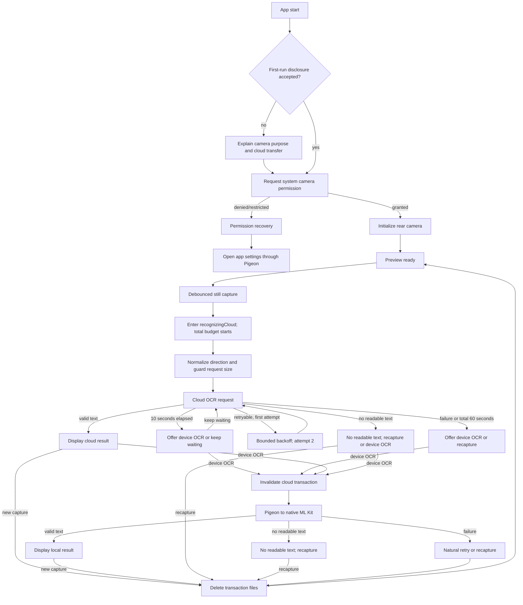

# Altinus Camera OCR Design

Date: 2026-09-28

Status: written design awaiting final user review

Authority: Altinus assignment README at commit `cb7c0d5323e9c0f347253cf52c09594e18342ced`

## 1. Goal and scope

Build a Flutter mobile app that lets a user preview the rear camera, capture one still image, run OCR without blocking the UI, and view the recognized text. The same core flow and recovery behavior must work on Android and iOS.

The implementation prioritizes functional completeness, observable recovery, and real-device evidence. Text editing, copying, history, gallery import, multi-page scanning, translation, authentication, analytics, and production backend operation are out of scope.

## 2. Fixed technical baseline

| Area | Decision |
|---|---|
| Flutter / Dart | Flutter `3.47.5` stable, Dart `3.13.4` |
| Local Apple toolchain | Xcode `26.1.1`, CocoaPods `1.16.2`; Xcode is not upgraded for this assignment |
| Platform minimums | Android API 24, iOS 15.5 |
| Camera | Flutter team `camera 0.12.1`, rear camera only |
| State | `flutter_riverpod 3.4.3`, manual `NotifierProvider`, no Riverpod code generation |
| Cloud OCR | Firebase AI Logic through Gemini Developer API, `gemini-3.8-flash`, low thinking level, structured JSON |
| FlutterFire line | Xcode-compatible BoM `4.11.0` family: `firebase_core 4.6.0`, `firebase_ai 3.10.0`; App Check is not wired into the evaluation build |
| Local OCR | Official bundled Google ML Kit Korean Text Recognition on Android and iOS |
| Native bridge | Pigeon `29.0.4`; generated Dart/Kotlin/Swift files are committed and never edited manually |

All resolved native dependency versions must be locked by Gradle and CocoaPods files. Dynamic version selectors are prohibited.

## 3. Architecture

```text
UI
 └─ OcrFlowController (Riverpod)
    ├─ DisclosureStore
    ├─ CameraRepository
    │  └─ official camera package
    └─ OcrRepository
       ├─ FirebaseAiOcrService
       └─ MlKitOcrService
          └─ generated Pigeon API
             ├─ Android Kotlin → official ML Kit Korean OCR
             └─ iOS Swift → official ML Kit Korean OCR
```

### UI

The UI renders immutable state and dispatches user actions. It does not call camera, Firebase, Pigeon, Kotlin, or Swift APIs directly. User-facing messages are short and action-oriented and never expose vendor names, HTTP status, exception class, stack trace, or error code.

### OcrFlowController

The controller owns the application state machine, one active transaction identifier, cloud attempt count, 10-second slow-response transition, total 60-second cloud budget, retry/fallback orchestration, and stale-result rejection. It does not parse SDK responses or own native resources.

### Repositories

Repositories expose domain operations and convert service output into domain results. `CameraRepository` owns camera initialization, capture, flash capability, and lifecycle calls. `OcrRepository` chooses the requested engine but does not run cloud and local OCR concurrently.

### Services and native adapters

Services are replaceable external adapters. Firebase parsing and error classification stay in `FirebaseAiOcrService`. `MlKitOcrService` passes a temporary image file path through generated Pigeon code. Kotlin and Swift create, use, and release their ML Kit input and recognizer resources asynchronously.

No separate use-case layer is added; it would only duplicate orchestration already owned by the controller.

## 4. Domain contracts

### Recognition result

```text
OcrResult
├─ textDetected(text)    text is non-empty and preserves observed line breaks
└─ noReadableText        valid completion with no readable text
```

Cloud structured output must explicitly identify one of these states. `textDetected` with blank text, a missing state, an unknown state, malformed JSON, or contradictory fields is an invalid response, not `noReadableText`.

OCR must transcribe visible text only. It must not guess missing characters, correct spelling, translate, summarize, or infer content. ML Kit returning zero blocks or an empty string maps to `noReadableText`.

### Error categories

```text
permission: denied | restrictedOrNoPrompt
camera: unavailable | initializationFailed | captureFailed | interrupted
input: missingFile | unsupported | preparationFailed | tooLarge
cloud: transportTransient | quota | configuration | unsupportedLocation
       | service | safetyOrRecitation | invalidResponse | deadline
local: bridge | recognizer | invalidInput
concurrency: duplicateCapture | staleResult | disposedOwner
```

The public Firebase exception type is used when it is specific. Exception message text is never parsed to reconstruct an HTTP status. Unknown or ambiguous failures are not guessed to be transient.

### Retry policy

- At most two cloud attempts exist in one transaction and the UI shows `1/2` or `2/2`.
- Only a clearly identified transport/transient failure is retried once with bounded exponential backoff and jitter.
- Quota, invalid configuration/key, disabled service, unsupported location, generic/ambiguous server failure, SDK parsing failure, safety/recitation, invalid schema, and the 60-second deadline are not automatically retried.
- A non-retryable failure or a failed second attempt offers local OCR or recapture.
- Choosing local OCR invalidates the cloud transaction. A late cloud completion is ignored.

## 5. State and data flow



Only one capture/OCR transaction may be active. Capture is disabled or ignored while capture is already starting. Every asynchronous completion carries its transaction identifier; it may update state only if that identifier remains active.

## 6. Timing behavior

The controller enters `recognizingCloud` immediately after a successful capture and starts the cloud budget before image preparation. Image preparation, first request, backoff, and second request share one cumulative 60-second budget. Retry and `조금 더 기다리기` never reset it.

At 10 seconds, the request is still valid. The UI presents `기기에서 인식` as the primary recovery action and `조금 더 기다리기` as the secondary action. Waiting continues the same request and attempt count.

At 60 seconds, the controller invalidates the transaction and offers local OCR or recapture. Dart timeout does not guarantee cancellation of the source future, so any later completion is discarded by transaction identity.

## 7. Camera, permission, and lifecycle UX

The first run shows a short disclosure before the system permission prompt:

- the camera is used to photograph text;
- the captured image is sent to a cloud recognition service first;
- the app does not retain the image in persistent local storage.

The disclosure does not claim that an external cloud provider never stores data. Its accepted state is kept behind `DisclosureStore` so the persistence mechanism can be replaced in tests.

Permission recovery distinguishes only states that the platform/package exposes reliably. It does not invent an Android permanent-denial code. Opening app settings uses the existing Pigeon boundary: `UIApplication.openSettingsURLString` on iOS and `ACTION_APPLICATION_DETAILS_SETTINGS` on Android.

The app owns camera lifecycle handling. It disposes the camera on inactive/background transitions and reinitializes it on resume when the flow still needs a preview. Capture and callbacks after disposal cannot update the active UI.

The rear camera is the only selectable camera. Supported devices initially expose automatic flash and flash off. Flash capability, actual firing, lifecycle restoration, and parity are real-device gates; if either platform is unreliable, the flash control is hidden or removed rather than shipped asymmetrically. Front camera switching, zoom, tap focus, and continuous torch are excluded.

## 8. Image handling and privacy

The camera capture file is the canonical transaction input. It remains available only while the current transaction may retry or switch engines. Pigeon receives a file path rather than image bytes.

Input preparation performs only:

1. orientation normalization using available EXIF/platform metadata;
2. proportional resize off the UI thread when required to remain inside the cloud request-size limit.

Automatic contrast, sharpening, denoising, and geometric deskew are excluded until a fixed input set demonstrates a measurable benefit without unacceptable CPU, memory, or character damage.

The app deletes transaction files on recapture, result exit, new flow, disposal, and recoverable startup cleanup of files created under its own temporary-file prefix. It never saves captures to the gallery or creates OCR history.

Logs may contain transaction IDs, domain error categories, attempt count, elapsed time, and lifecycle state. They must not contain an image, recognized text, raw model response, API credential, or local image path.

## 9. Cloud and local OCR deployment

Firebase AI Logic uses the Gemini Developer API from the client SDK. A direct Gemini secret key is not embedded or disguised through Gradle variables. Platform Firebase configuration is supplied according to Firebase's mobile setup and the README explains the evaluator setup needed for a clean checkout.

The evaluation build uses the no-billing/free path only after live quota and model availability are rechecked. App Check integration and enforcement are excluded from the evaluation build because an unknown evaluator device cannot be pre-registered. This is documented as an abuse-protection trade-off, not a production recommendation.

The local fallback bundles the official Korean recognizer on both platforms so it works without a model download. Its supported claim is Korean and Latin-family text; wider language coverage belongs to cloud OCR. Cloud unavailability must not prevent the evaluator from exercising the local fallback.

## 10. Result and recovery screens

The result screen displays recognized text with preserved line breaks. It does not provide editing or a copy button. Every result offers a new capture. A cloud result additionally offers device OCR when the user distrusts it; a local result does not loop back into another automatic cloud request.

`noReadableText` is a successful empty result, not a system error. Its screen states that readable text was not found without claiming whether darkness, blur, angle, or absence of text caused it. The primary action is recapture; the secondary action is local OCR when the cloud path produced the empty result.

All error states use natural language and a next action. Firebase, Gemini, ML Kit, Pigeon, HTTP, and platform exception names remain internal.

## 11. Verification strategy

### Automated layers

1. **State-machine unit tests with a fake clock** cover 9.999/10-second and 59.999/60-second boundaries, retry budget preservation, attempt counters, user-directed waiting, local switch, late completion, duplicate capture, cleanup, and lifecycle invalidation.
2. **Repository/service tests** cover structured success, explicit no-text, blank/contradictory/malformed responses, error classification, no message parsing, and log redaction.
3. **Widget tests with Riverpod overrides** cover disclosure, permission outcomes, preview/loading/result/empty/error screens, debounce, counters, 10/60-second actions, settings navigation, and absence of technical error text.
4. **Pigeon/native tests** cover generated-contract drift, a fake Host API, valid/empty/missing files, async completion, resource release, and at least one Dart-to-native call on each platform.
5. **Integration tests** cover the complete deterministic flow with fake camera and OCR adapters. Live camera and OCR claims come only from native real-device runs.

### Fixed input set

The same recorded set contains Korean plus Latin text, no text, low light, motion/defocus blur, tilted text, 90-degree rotation, long multiline text, and an oversized source. Fixtures verify deterministic parsing and engine behavior; physical recaptures verify camera behavior and recovery UX. Bad input passes when the app returns useful text or a truthful recoverable empty/failure state without freezing or exposing technical details.

### Real-device matrix

Android is the iterative device. A borrowed iPhone is a required final verification dependency. Each platform separately covers permission/settings recovery, preview/capture, flash gate, live Firebase OCR, offline local OCR, background/resume, orientation, rapid taps, ten repeated capture cycles, bad-input samples, and the 10/60-second flow.

Performance runs use profile mode and record frame traces around preview, preparation, cloud dispatch, and local OCR. Memory evidence records RSS/external-memory behavior before and after repeated capture cycles and checks for monotonic resource retention. CPU, device heat observations, model, OS, date, commit, build mode, result, and artifact path are recorded. A simulator, emulator, Chrome, or Android result never substitutes for iPhone real-device evidence.

Google ARTEMIS may automate Android UI flows. Chrome DevTools MCP and Python CDP may inspect Flutter DevTools or browser artifacts only; neither is native camera evidence.

### Clean-checkout gate

Before delivery, clone the repository into a new directory and follow only its README. Verify dependency resolution, generated-code presence, static analysis, tests, Android build/install/run, iOS build/install/run, Firebase configuration behavior, and local fallback without relying on ignored developer files. Then verify that the GitHub URL is readable by an evaluator. Email submission is a separate external action and requires explicit user authorization at action time.

## 12. Evidence ledger

Each claim in the final README must link to one of:

- an automated test and recorded command/result;
- a dated real-device run containing commit, device, OS, build mode, result, and artifact;
- a dependency lockfile or official compatibility source;
- an AI decision-log entry paired with the implementation diff or verification that accepted, modified, or rejected it.

Plans and intended devices are never reported as completed verification. If the iPhone is unavailable, the README must say that iOS real-device performance is unverified rather than infer success from a simulator or Android.

## 13. Required documentation reconciliation gate (D0)

This gate is mandatory after the user approves this written spec and before implementation-plan execution. It is a targeted consistency pass, not a documentation expansion project.

| Existing file | Required correction | Completion evidence |
|---|---|---|
| `docs/PRD.md` | Record Flutter as chosen; remove selectable/copyable result scope; align hybrid OCR, 10/60-second behavior, platform evidence, and non-goals | No statement conflicts with this spec or assignment README; file remains below 10 KB |
| `docs/CONTEXT.md` | Replace stale tool versions and undecided stack/OCR/state entries; preserve source priority and current risks | File stays below 10 KB and matches verified environment facts |
| `docs/E2E_TESTING.md` | Add clean-checkout, fixed-input, cloud/local, Pigeon, profile/memory, and two-device gates; correct platform-specific permission wording | Every assignment requirement maps to an evidence-producing check |
| `AGENTS.md` and `.agents/catalog.yaml` | Inspect planner/implementer boundaries, parallel ownership, file-finder role, model/effort choices, and documentation-only-work guard; change only confirmed drift | `AGENTS.md` remains below 10 KB; YAML parsing and required/forbidden-role contract checks pass; no role owns both unresolved design and broad implementation |
| `docs/AI_PROMPT_LOG.md` | Preserve append-only decision summaries and add implementation/test evidence only after it exists | Final README AI examples trace to adopted, modified, and rejected entries |

No new document is created solely to track this gate. The implementation plan must make D0 its first executable task and must not mark it complete until the listed checks pass.

## 14. Delivery boundaries

The final repository README briefly records architecture and libraries, trade-offs and known limits, test commands/results and exact devices, AI tools and scope, AI output used as-is versus directly corrected/verified, and representative rejected suggestions with reasons.

No push, public repository creation, recruiter email, or assignment submission is authorized by this design. Those external actions remain separate and require current status, deadline, visibility, reversibility, and user confirmation checks.

## 15. Hiring-perspective review

Overall design-readiness score: **91/100**.

- **HR / recruiter: 88/100.** The design traces the assignment, AI decisions, trade-offs, and truthful verification limits. The remaining risk is presentation: the final README must condense this evidence instead of copying the full design narrative.
- **Hiring manager / development lead: 92/100.** The state, native, lifecycle, privacy, and test boundaries are implementation-ready. The unresolved proof obligations are live Firebase behavior, generated Pigeon integration, clean-checkout builds, and real-device evidence on both platforms.

The highest-leverage completion steps are D0 document reconciliation, state-machine tests before controller implementation, and early Android/iOS camera/native smoke runs rather than deferring platform integration to the end.

## 16. Sources

- [Altinus assignment README, pinned commit `cb7c0d5323e9c0f347253cf52c09594e18342ced`](https://github.com/git-artinus/artinus-fe-recurit/blob/cb7c0d5323e9c0f347253cf52c09594e18342ced/README.md)
- [Flutter integration testing](https://docs.flutter.dev/testing/integration-tests), [performance profiling](https://docs.flutter.dev/perf/ui-performance), [memory](https://docs.flutter.dev/tools/devtools/memory), and [app architecture](https://docs.flutter.dev/app-architecture)
- [Flutter camera](https://pub.dev/packages/camera), [Pigeon](https://pub.dev/packages/pigeon), and [Riverpod](https://riverpod.dev/docs/introduction/getting_started)
- [Firebase AI Logic](https://firebase.google.com/docs/ai-logic), [Gemini API troubleshooting](https://ai.google.dev/gemini-api/docs/troubleshooting), and [Google ML Kit Text Recognition](https://developers.google.com/ml-kit/vision/text-recognition/v2)
- [Apple privacy guidance](https://developer.apple.com/design/human-interface-guidelines/privacy) and [Android runtime permission guidance](https://developer.android.com/training/permissions/requesting)
